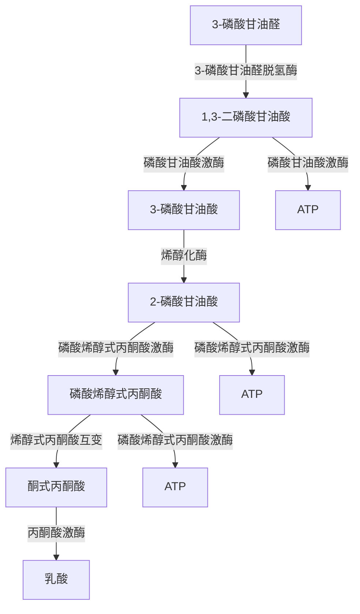
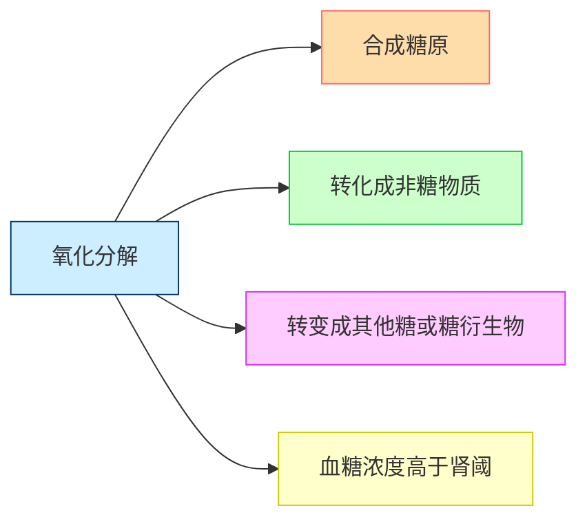

# 【1】糖代谢简述

<kaodian :text="'生物化学检验记忆卡'" />

<!-- ###### 第二章 糖代谢紊乱及糖尿病的检查

> 临床生化检验 -->

<beitiS/>

---

## (1)基础知识

<son :text="'生物化学检验记忆卡'" text1="(1)基础知识" :textOption="[['熟练掌握','基础知识','超纲'],['熟练掌握','基础知识','超纲'],['熟练掌握','基础知识','超纲']]" />

::::tip

### 1.1 糖酵解途径（无氧氧化）

在无氧情况下，葡萄糖分解生成乳酸的过程。

:::code-group

```js [第一阶段：引发阶段]
第一阶段：引发阶段,由葡萄糖生成 1，6-果糖二磷酸

1. 葡萄糖的磷酸化、异构化、再磷酸化生成 1，6-果糖二磷酸：
   葡萄糖磷酸化成为葡萄糖-6-磷酸，由己糖激酶催化。为不可逆的磷酸化反应，酵解过程关键步骤之一，是葡萄糖进入任何代谢途径的起始反应，消耗 1 分子 ATP。

2. 葡萄糖-6-磷酸转化为果糖-6-磷酸，磷酸己糖异构酶催化；

3. 果糖-6-磷酸磷酸化，转变为由 6 磷酸果糖激酶催化，消耗 1 分子 ATP，是第二个不可逆的磷酸化反应，酵解过程关键步骤之二，是葡萄糖氧化过程中最重要的调节点。
```

```js [第二阶段：裂解阶段]
第二阶段：裂解阶段
1，6-果糖二磷酸折半分解成 2 分子磷酸丙糖（磷酸二羟丙酮和 3-磷酸甘油醛），醛缩酶催化，二者可互变，最终 1 分子葡萄糖转变为 2 分子 3-磷酸甘油醛。
```

```js [第三阶段：氧化还原。]
第三阶段：通过氧化还原生成乳酸。（能量的释放和保留）

1. 3-磷酸甘油醛的氧化和 NAD+的还原，由 3-磷酸甘油醛脱氢酶催化，生成 1，3-二磷酸甘油酸，产生一个高能磷酸键，同时生成 NADH 用于第七步丙酮酸的还原。

2. 1，3-二磷酸甘油酸的氧化和 ADP 的磷酸化，生成 3-磷酸甘油酸和 ATP。磷酸甘油酸激酶催化。
3. 3-磷酸甘油酸转变为 2-磷酸甘油酸。

4. 2-磷酸甘油酸经烯醇化酶催化脱水，通过分子重排，生成具有一个高能磷酸键的磷酸烯醇式丙酮酸。

5. 磷酸烯醇式丙酮酸经丙酮酸激酶催化将高能磷酸键转移给 ADP，生成烯醇式丙酮酸和 ATP，为不可逆反应，酵解过程关键步骤之三。

6. 烯醇式丙酮酸与酮式丙酮酸的互变。

7. 丙酮酸还原生成乳酸。
```

:::
::::

:::details 图片记忆




:::

::::warning
1 分子的葡萄糖通过无氧酵解可净生成 2 个分子三磷酸腺苷（ATP），这一过程全部在胞浆中完成。

::::

::::tip

### 生理意义

```js

1. 是机体在`缺氧或无氧`状态获得能量的有效措施；
2. 是某些组织细胞获得能量的方式，如`红细胞`、视网膜、角膜、晶状体、睾丸、肾髓质等。
3. 糖酵解的某些中间产物是脂类、氨基酸等的合成前体，并与其他代谢途径相联系。
```

::::
::::tip

### 1.2 糖的有氧氧化途径

葡萄糖在有氧条件下彻底氧化成水和二氧化碳的过程.

:::code-group

```js [第一阶段：胞液反应阶段]
第一阶段：胞液反应阶段:
从葡萄糖到丙酮酸，反应过程同糖酵解。

糖酵解产物 NADH 不用于还原丙酮酸生成乳酸，二者进入线粒体氧化。
```

```js [第二阶段：线粒体中的反应阶段]
第二阶段：线粒体中的反应阶段:
1. 丙酮酸经丙酮酸脱氢酶复合体氧化脱羧生成乙酰 CoA，是关键性的不可逆反应。其特征是丙酮酸氧化释放的能量以高能硫酯键的形式储存于乙酰 CoA 中，这是进入三羧酸循环的开端。
2. 三羧酸循环
三羧酸循环是在线粒体内进行的一系列酶促连续反应，从乙酰 CoA 和草酰乙酸缩合成柠檬酸到草酰乙酸的再生，构成一次循环过程，其间共进行四次脱氢，脱下的 4 对氢，经氧化磷酸化生成 H₂0 和 ATP。2 次脱羧产生 2 分 CO₂。
3. 氧化磷酸化
线粒体内膜上分布有紧密相连的两种呼吸链，即 NADH 呼吸链和琥珀酸呼吸链。
呼吸链的功能是把代谢物脱下的氢氧化成水，同时产生大量能量以驱动 ATP 合成。1 个分子的葡萄糖彻底氧化为 CO₂和 H₂O，可生成 36 或 38 个分子的 ATP。
```

:::

:::details 三羧酸循环的特点

1. 从柠檬酸的合成到 α-酮戊二酸的氧化阶段为不可逆反应，故整个循环是不可逆的；
2. 在循环转运时，其中每一成分既无净分解，也无净合成。但如移去或增加某一成分，则将影响循环速度；
3. 三羧酸循环氧化乙酰 CoA 的效率取决于草酰乙酸的浓度；
4. 每次循环所产生的 NADH 和 FADH₂ 都可通过与之密切联系的呼吸链进行氧化磷酸化以产生 ATP；
5. 该循环的限速步骤是异柠檬酸脱氢酶催化的反应，该酶是变构酶，ADP 是其激活剂，ATP 和 NADH 是其抑制剂。

:::

```js
生理意义
有氧氧化是糖氧化提供能量的主要方式。
```

::::

:::tip

### 1.3 磷酸戊糖途径

在胞浆中进行，存在于肝脏、乳腺、红细胞等组织。

磷酸戊糖生理意义

```js
1. 提供 5-磷酸核糖，用于核苷酸和核酸的生物合成。
2. 提供 NADPH，参与多种代谢反应，维持谷胱甘肽的还原状态等。
```

:::

:::tip

### 1.4 糖原的合成分解途径

糖原是动物体内糖的储存形式，是葡萄糖通过 α-1，4 糖苷键和 α-1，6 糖苷键相连而成的具有高度分枝的聚合物。

```js
机体摄入的糖大部分转变成脂肪（甘油三酯）后储存于脂肪组织内，只有一小部分以糖原形式储存。
糖原主要分为`肝糖原`和`肌糖原`，糖原是可以迅速动用的葡萄糖储备。

糖原合成酶是糖原合成中的关键酶，受 G-6-P 等多种因素调控。
葡萄糖合成糖原是耗能的过程，合成 1 分子糖原需要消耗`2个`ATP。

肝脏存在葡萄糖-6-磷酸酶，可使肝糖原分解成葡萄糖补充血糖。
肌肉组织无葡萄糖-6-磷酸酶，不能直接分解成葡萄糖，肌糖原分解产能可供肌肉收缩需要。
```

:::

:::tip

### 1.5 糖异生途径

由非糖物质转变为葡萄糖的过程称为糖异生。是体内单糖生物合成的唯一途径。`肝脏`是糖异生的主要器官，长期饥饿、酸中毒时肾脏的异生作用增强。

```js
 1. 过程:
糖异生的途径基本上是糖酵解的逆向过程，但不是完全可逆过程。
酵解过程中三个关键酶催化的反应是不可逆的，故需通过糖异生的 4 个关键酶（葡萄糖-6-磷酸酶、果糖-1，6-二磷酸酶、丙酮酸羧化酶、磷酸烯醇式丙酮酸激酶）绕过糖酵解的三个能障生成葡萄糖。

2. 生理意义:
   1. 补充血糖，维持血糖水平恒定。
   2. 防止乳酸中毒。
   3. 协助氨基酸代谢。

```

:::

:::tip

### 1.6 糖醛酸途径

```js
 生理意义
生成有活性的葡萄糖醛酸，它是生物转化中重要的结合剂；
葡萄糖醛酸还是蛋白聚糖的重要组成成分，如硫酸软骨素、透明质酸、肝素等。
```

:::

## (2)血糖的来源与去路

<son :text="'生物化学检验记忆卡'" text1="(2)血糖的来源与去路" :textOption="[['熟练掌握','基础知识','相关专业知识'],['熟练掌握','基础知识','相关专业知识'],['熟练掌握','基础知识','相关专业知识']]" />

> 血液中的葡萄糖称为血糖。

:::tip

### 2.1 血糖的概述

空腹时血糖浓度为`3.61～6.11mmol／L`。

```js
血糖恒定的主要意义是保证中枢神经的供能。`脑细胞`所需的能量几乎完全直接来自血糖。
血糖浓度之所以能维持相对恒定，是由于其来源与去路能保持动态平衡的结果。
```

:::

:::tip

### 2.2 血糖来源

```js
1. 糖类消化吸收:
食物中的糖类消化吸收入血，这是血糖最主要的来源。
2. 肝糖原分解:
短期饥饿后，肝中储存的糖原分解成葡萄糖进入血液，
3. 糖异生作用:
在较长时间饥饿后，氨基酸、甘油等非糖物质在肝内合成葡萄糖。
4. 其他单糖的转化。
```

:::

::::tip

### 2.3 血糖去路

:::code-group

```js [氧化分解]
1. 氧化分解:
葡萄糖在组织细胞中通过有氧氧化和无氧酵解产生` ATP`，为细胞代谢供给能量，此为血糖的主要去路。
```

```js [合成糖原]
2. 合成糖原:
进食后，`肝和肌肉`等组织将葡萄糖合成糖原以储存。
```

```js [转化成非糖物质]
3. 转化成非糖物质:
转化为甘油、脂肪酸以合成脂肪；转化为氨基酸以合成蛋白质。
```

```js [转变成其他糖或糖衍生物]
4. 转变成其他糖或糖衍生物
如核糖、脱氧核糖、氨基多糖等。
```

```js [血糖浓度高于肾阈]
5. 血糖浓度高于肾阈:
（8.9 ～ 9.9mmol／L，160 ～ 180mg／dl）时可随尿排出一部分。

```

:::

::::
下面是血糖去路的表格演示：

| 血糖去路               | 描述                                                                                    |
| ---------------------- | --------------------------------------------------------------------------------------- |
| 氧化分解               | 葡萄糖在组织细胞中通过有氧氧化和无氧酵解产生ATP，为细胞代谢供给能量，是血糖的主要去路。 |
| 合成糖原               | 进食后，肝和肌肉等组织将葡萄糖合成糖原以储存。                                          |
| 转化成非糖物质         | 葡萄糖可转化为甘油、脂肪酸以合成脂肪；也可转化为氨基酸以合成蛋白质。                    |
| 转变成其他糖或糖衍生物 | 葡萄糖可转变成其他糖或糖衍生物，如核糖、脱氧核糖、氨基多糖等。                          |
| 血糖浓度高于肾阈       | 当血糖浓度超过肾阈（8.9 ～ 9.9mmol/L，160 ～ 180mg/dL）时，一部分血糖可随尿液排出。     |



## (3)血糖浓度的调节

<son :text="'生物化学检验记忆卡'" text1="(3)血糖浓度的调节" :textOption="[['熟练掌握','基础知识','相关专业知识'],['熟练掌握','基础知识','相关专业知识'],['熟练掌握','基础知识','相关专业知识']]" />

> 血糖的来源与去路能保持动态平衡受到`神经`、`激素`和`器官`三方面的调节作用。

::::tip

### 3.1 激素的调节作用

参与血糖浓度调节的激素有两类：一类是降低血糖的激素，一类是升高血糖的激素，最主要的是胰岛素和胰高血糖素，是调节血糖浓度的主要激素它们对血糖浓度的调节是通过对糖代谢途径中一些关键酶的诱导、激活或抑制来实现的。

:::code-group

```js [胰岛素]
1. 胰岛素:
是最主要的降血糖激素，由`胰岛B细胞（β细胞）`所产生胰岛素作用的部位：`肝脏、肌肉组织、脂肪组织`
总效应是使血糖去路增加，来源减少，血糖水平降低。
```

```js [胰高血糖素]
2. 胰高血糖素:
是升高血糖浓度的最重要的激素。是由 `胰岛A-细胞（α细胞）`合成和分泌的 29 个氨基酸组成的肽类激素。胰高糖素主要通过提高靶细胞内 cAMP 含量达到调节血糖浓度的目的。
总效应是使血糖来源增加，去路减少，血糖水平升高。
```

```js [其他升高血糖的激素]
3. 其他升高血糖的激素:
糖皮质激素和生长激素主要刺激糖异生作用，肾上腺素主要促进糖原分解。
这三个激素和胰高血糖素的主要作用是为细胞提供葡萄糖的来源。
胰岛素和胰高血糖素是调节血糖浓度的主要激素 ，而血糖水平保持恒定则不仅是糖本身，还有脂肪、氨基酸代谢的协调作用共同完成。
```

:::

::::

:::tip

### 3.2 神经系统的调节作用

```js
神经系统对血糖的调节主要通过下丘脑和植物神经系统调节其所控激素的分泌，
进而再影响血糖代谢中关键酶的活性，达到调节血糖浓度的作用。
```

:::

:::tip

### 3.3 肝的调节作用

`肝脏`是维持血糖恒定的关键器官。

```js
肝脏具有双向调控功能，它通过肝糖原的合成、分解，糖的氧化分解，
转化为其他非糖物质或其他糖类，以及糖异生和其他单糖转化为葡萄糖来维持血糖的相对恒定。
肝功能受损时，可能影响糖代谢而易出现血糖的波动。
```

:::

## (4)胰岛素的代谢

<son :text="'生物化学检验记忆卡'" text1="(4)胰岛素的代谢" :textOption="[['熟练掌握','相关专业知识','专业知识'],['熟练掌握','相关专业知识','专业知识'],['熟练掌握','相关专业知识','专业知识']]" />

:::tip

### 4.1 合成降解

胰岛素是`胰岛β细胞`分泌的一种由 51 个氨基酸组成的多肽类激素。

```js
合成过程:
胰岛 β 细胞首先在粗面内质网生成含 102 个氨基酸的前胰岛素原，穿过内质网膜，同时切除 16 个氨基酸的引导序列而成为含 86 个氨基酸的胰岛素原，当 β 细胞接受刺激后，β 颗粒移向细胞膜，并在蛋白水解酶的作用下，使胰岛素原分解脱下一段含 31 个氨基酸的 C 肽和精-赖、精-精两对氨基酸，形成由 30 个氨基酸残基构成的 β 链和 21 个氨基酸残体基构成的 α 链。

胰岛素分泌时有等分子` C 肽`和少量胰岛素原入血。// [!code focus]

C 肽无胰岛素的`生物活性和免疫性`，// [!code focus]
半寿期 15 分钟左右。胰岛素原有 3%的胰岛素活性与胰岛素有免疫交叉，正常时有 3-5%的胰岛素原未经裂解从 β 细胞释放。半寿期比胰岛素长。胰岛素主要由肝脏摄取并降解。半寿期约 5min 左右。
```

:::

:::tip

### 4.2 分泌

主要生理刺激因子:`高血糖`.正常人呈脉冲式分泌。

```js
其他生理刺激因子:
如血液中的高氨基酸、脂肪酸、胰高血糖素等，及一些药物也可刺激胰岛素分泌。

胰岛素的基础分泌量为每小时 0.5 ～ 1.0 单位，进食后分泌量可增加 3 ～ 5 倍。
```

:::

:::tip

### 4.3 作用机制

```js
1. 胰岛素发挥作用首先要与靶细胞表面的特殊蛋白受体结合:
胰岛素受体广泛分布于哺乳动物的细胞表面。主要分布于脑细胞、性腺细胞、红细胞和血管内皮细胞。
血糖浓度 ↑，刺激胰岛 β 细胞分泌胰岛素
胰岛素 + 受体 α 亚基 → 受体变构 → 激活 β 亚基蛋白激酶 → 生物效应


2. 胰岛素生物活性效应的强弱取决于:
 1. 到达靶细胞的胰岛素浓度；
 2. 靶细胞表面受体的绝对或相对数目；
 3. 受体与胰岛素的亲和力；
 4. 胰岛素与受体结合后细胞内的代谢变化。

3. 胰岛素受体的作用:
 1. 与胰岛素特异地高亲和力地结合；
 2. 转移信息引起细胞内代谢途径的变化。

```

:::
