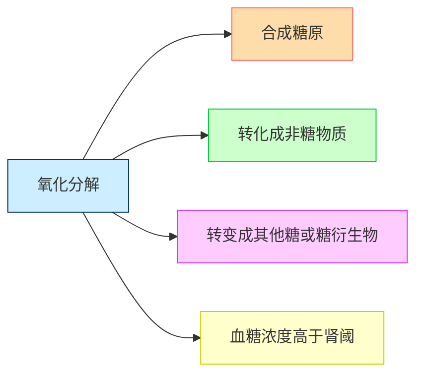

# 【1】糖代谢简述

<kaodian :text="'生物化学检验记忆卡'" />

<!-- ###### 第二章 糖代谢紊乱及糖尿病的检查

> 临床生化检验 -->

<beitiS/>

---

## (2)血糖的来源与去路

<son :text="'生物化学检验记忆卡'" text1="(2)血糖的来源与去路" :textOption="[['熟练掌握','基础知识','相关专业知识'],['熟练掌握','基础知识','相关专业知识'],['熟练掌握','基础知识','相关专业知识']]" />

> 血液中的葡萄糖称为血糖。

:::tip

### 2.1 血糖的概述

空腹时血糖浓度为`3.61～6.11mmol／L`。

```js
血糖恒定的主要意义是保证中枢神经的供能。`脑细胞`所需的能量几乎完全直接来自血糖。
血糖浓度之所以能维持相对恒定，是由于其来源与去路能保持动态平衡的结果。
```

:::

:::tip

### 2.2 血糖来源

```js
1. 糖类消化吸收:
食物中的糖类消化吸收入血，这是血糖最主要的来源。
2. 肝糖原分解:
短期饥饿后，肝中储存的糖原分解成葡萄糖进入血液，
3. 糖异生作用:
在较长时间饥饿后，氨基ß酸、甘油等非糖物质在肝内合成葡萄糖。
4. 其他单糖的转化。
```

:::

::::tip

### 2.3 血糖去路

:::code-group

```js [氧化分解]
1. 氧化分解:
葡萄糖在组织细胞中通过有氧氧化和无氧酵解产生` ATP`，为细胞代谢供给能量，此为血糖的主要去路。
```

```js [合成糖原]
2. 合成糖原:
进食后，`肝和肌肉`等组织将葡萄糖合成糖原以储存。
```

```js [转化成非糖物质]
3. 转化成非糖物质:
转化为甘油、脂肪酸以合成脂肪；转化为氨基酸以合成蛋白质。
```

```js [转变成其他糖或糖衍生物]
4. 转变成其他糖或糖衍生物
如核糖、脱氧核糖、氨基多糖等。
```

```js [血糖浓度高于肾阈]
5. 血糖浓度高于肾阈:
（8.9 ～ 9.9mmol／L，160 ～ 180mg／dl）时可随尿排出一部分。

```

:::

::::
下面是血糖去路的表格演示：

| 血糖去路               | 描述                                                                                    |
| ---------------------- | --------------------------------------------------------------------------------------- |
| 氧化分解               | 葡萄糖在组织细胞中通过有氧氧化和无氧酵解产生ATP，为细胞代谢供给能量，是血糖的主要去路。 |
| 合成糖原               | 进食后，肝和肌肉等组织将葡萄糖合成糖原以储存。                                          |
| 转化成非糖物质         | 葡萄糖可转化为甘油、脂肪酸以合成脂肪；也可转化为氨基酸以合成蛋白质。                    |
| 转变成其他糖或糖衍生物 | 葡萄糖可转变成其他糖或糖衍生物，如核糖、脱氧核糖、氨基多糖等。                          |
| 血糖浓度高于肾阈       | 当血糖浓度超过肾阈（8.9 ～ 9.9mmol/L，160 ～ 180mg/dL）时，一部分血糖可随尿液排出。     |



## (3)血糖浓度的调节

<son :text="'生物化学检验记忆卡'" text1="(3)血糖浓度的调节" :textOption="[['熟练掌握','基础知识','相关专业知识'],['熟练掌握','基础知识','相关专业知识'],['熟练掌握','基础知识','相关专业知识']]" />

> 血糖的来源与去路能保持动态平衡受到`神经`、`激素`和`器官`三方面的调节作用。

::::tip

### 3.1 激素的调节作用

参与血糖浓度调节的激素有两类：一类是降低血糖的激素，一类是升高血糖的激素，最主要的是胰岛素和胰高血糖素，是调节血糖浓度的主要激素它们对血糖浓度的调节是通过对糖代谢途径中一些关键酶的诱导、激活或抑制来实现的。

:::code-group

```js [胰岛素]
1. 胰岛素:
是最主要的降血糖激素，由`胰岛B细胞（β细胞）`所产生胰岛素作用的部位：`肝脏、肌肉组织、脂肪组织`
总效应是使血糖去路增加，来源减少，血糖水平降低。
```

```js [胰高血糖素]
2. 胰高血糖素:
是升高血糖浓度的最重要的激素。是由 `胰岛A-细胞（α细胞）`合成和分泌的 29 个氨基酸组成的肽类激素。胰高糖素主要通过提高靶细胞内 cAMP 含量达到调节血糖浓度的目的。
总效应是使血糖来源增加，去路减少，血糖水平升高。
```

```js [其他升高血糖的激素]
3. 其他升高血糖的激素:
糖皮质激素和生长激素主要刺激糖异生作用，肾上腺素主要促进糖原分解。
这三个激素和胰高血糖素的主要作用是为细胞提供葡萄糖的来源。
胰岛素和胰高血糖素是调节血糖浓度的主要激素 ，而血糖水平保持恒定则不仅是糖本身，还有脂肪、氨基酸代谢的协调作用共同完成。
```

:::

::::

:::tip

### 3.2 神经系统的调节作用

```js
神经系统对血糖的调节主要通过下丘脑和植物神经系统调节其所控激素的分泌，
进而再影响血糖代谢中关键酶的活性，达到调节血糖浓度的作用。
```

:::

:::tip

### 3.3 肝的调节作用

`肝脏`是维持血糖恒定的关键器官。

```js
肝脏具有双向调控功能，它通过肝糖原的合成、分解，糖的氧化分解，
转化为其他非糖物质或其他糖类，以及糖异生和其他单糖转化为葡萄糖来维持血糖的相对恒定。
肝功能受损时，可能影响糖代谢而易出现血糖的波动。
```

:::

## (4)胰岛素的代谢

<son :text="'生物化学检验记忆卡'" text1="(4)胰岛素的代谢" :textOption="[['熟练掌握','相关专业知识','专业知识'],['熟练掌握','相关专业知识','专业知识'],['熟练掌握','相关专业知识','专业知识']]" />

:::tip

### 4.1 合成降解

胰岛素是`胰岛β细胞`分泌的一种由 51 个氨基酸组成的多肽类激素。

```js
合成过程:
胰岛 β 细胞首先在粗面内质网生成含 102 个氨基酸的前胰岛素原，穿过内质网膜，同时切除 16 个氨基酸的引导序列而成为含 86 个氨基酸的胰岛素原，当 β 细胞接受刺激后，β 颗粒移向细胞膜，并在蛋白水解酶的作用下，使胰岛素原分解脱下一段含 31 个氨基酸的 C 肽和精-赖、精-精两对氨基酸，形成由 30 个氨基酸残基构成的 β 链和 21 个氨基酸残体基构成的 α 链。

胰岛素分泌时有等分子` C 肽`和少量胰岛素原入血。// [!code focus]

C 肽无胰岛素的`生物活性和免疫性`，// [!code focus]
半寿期 15 分钟左右。胰岛素原有 3%的胰岛素活性与胰岛素有免疫交叉，正常时有 3-5%的胰岛素原未经裂解从 β 细胞释放。半寿期比胰岛素长。胰岛素主要由肝脏摄取并降解。半寿期约 5min 左右。
```

:::

:::tip

### 4.2 分泌

主要生理刺激因子:`高血糖`.正常人呈脉冲式分泌。

```js
其他生理刺激因子:
如血液中的高氨基酸、脂肪酸、胰高血糖素等，及一些药物也可刺激胰岛素分泌。

胰岛素的基础分泌量为每小时 0.5 ～ 1.0 单位，进食后分泌量可增加 3 ～ 5 倍。
```

:::

:::tip

### 4.3 作用机制

```js
1. 胰岛素发挥作用首先要与靶细胞表面的特殊蛋白受体结合:
胰岛素受体广泛分布于哺乳动物的细胞表面。主要分布于脑细胞、性腺细胞、红细胞和血管内皮细胞。
血糖浓度 ↑，刺激胰岛 β 细胞分泌胰岛素
胰岛素 + 受体 α 亚基 → 受体变构 → 激活 β 亚基蛋白激酶 → 生物效应


2. 胰岛素生物活性效应的强弱取决于:
 1. 到达靶细胞的胰岛素浓度；
 2. 靶细胞表面受体的绝对或相对数目；
 3. 受体与胰岛素的亲和力；
 4. 胰岛素与受体结合后细胞内的代谢变化。

3. 胰岛素受体的作用:
 1. 与胰岛素特异地高亲和力地结合；
 2. 转移信息引起细胞内代谢途径的变化。

```

:::
