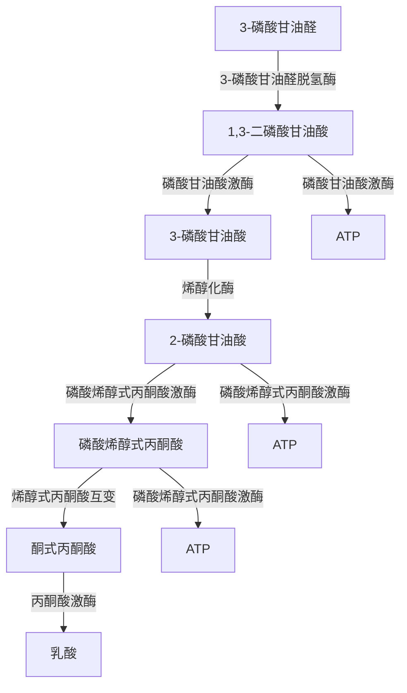
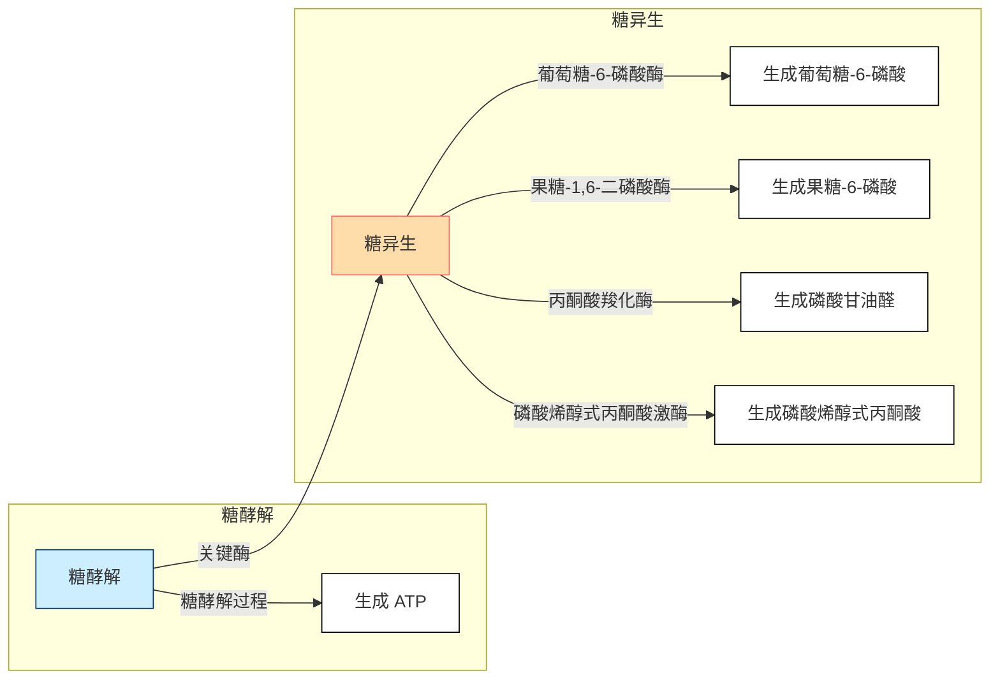
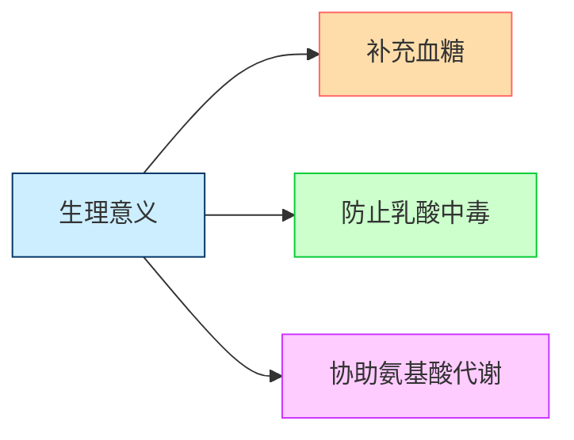
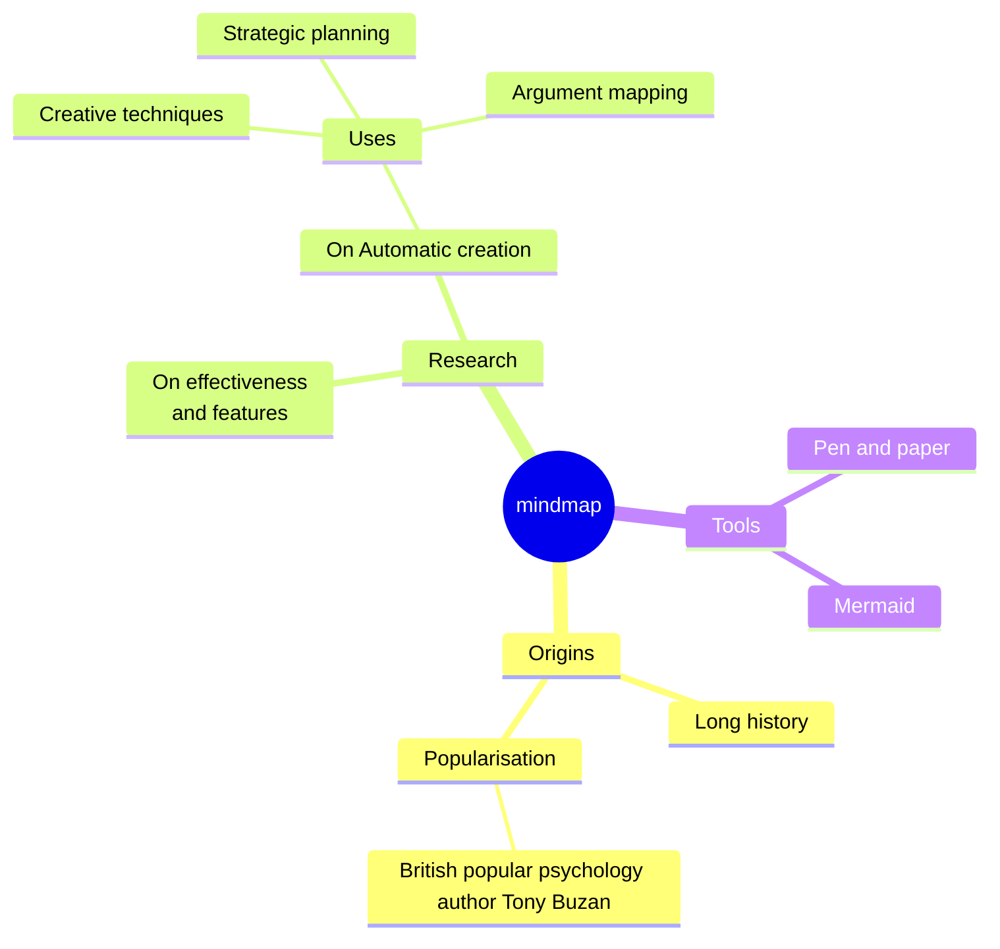

# 【1】糖代谢简述-基础知识

<kaodian :text="'生物化学检验记忆卡'" />

<beitiS/>

---

<font-awesome-icon icon="fa-solid fa-user-secret" />

## 1.1 糖酵解途径（无氧氧化）

<son :text="'生物化学检验记忆卡'" text1="(1)基础知识" :textOption="[['熟练掌握','基础知识','超纲'],['熟练掌握','基础知识','超纲'],['熟练掌握','基础知识','超纲']]" />

::::tip

:::details 图片记忆




:::

在无氧情况下，葡萄糖分解生成乳酸的过程。

:::code-group

```js [第一阶段：引发阶段]
第一阶段：引发阶段,由葡萄糖生成 1，6-果糖二磷酸

1. 葡萄糖的磷酸化、异构化、再磷酸化生成 1，6-果糖二磷酸：
   葡萄糖磷酸化成为葡萄糖-6-磷酸，由己糖激酶催化。为不可逆的磷酸化反应，酵解过程关键步骤之一，是葡萄糖进入任何代谢途径的起始反应，消耗 1 分子 ATP。

2. 葡萄糖-6-磷酸转化为果糖-6-磷酸，磷酸己糖异构酶催化；

3. 果糖-6-磷酸磷酸化，转变为由 6 磷酸果糖激酶催化，消耗 1 分子 ATP，是第二个不可逆的磷酸化反应，酵解过程关键步骤之二，是葡萄糖氧化过程中最重要的调节点。
```

```js [第二阶段：裂解阶段]
第二阶段：裂解阶段
1，6-果糖二磷酸折半分解成 2 分子磷酸丙糖（磷酸二羟丙酮和 3-磷酸甘油醛），醛缩酶催化，二者可互变，最终 1 分子葡萄糖转变为 2 分子 3-磷酸甘油醛。
```

```js [第三阶段：氧化还原。]
第三阶段：通过氧化还原生成乳酸。（能量的释放和保留）

1. 3-磷酸甘油醛的氧化和 NAD+的还原，由 3-磷酸甘油醛脱氢酶催化，生成 1，3-二磷酸甘油酸，产生一个高能磷酸键，同时生成 NADH 用于第七步丙酮酸的还原。

2. 1，3-二磷酸甘油酸的氧化和 ADP 的磷酸化，生成 3-磷酸甘油酸和 ATP。磷酸甘油酸激酶催化。
3. 3-磷酸甘油酸转变为 2-磷酸甘油酸。

4. 2-磷酸甘油酸经烯醇化酶催化脱水，通过分子重排，生成具有一个高能磷酸键的磷酸烯醇式丙酮酸。

5. 磷酸烯醇式丙酮酸经丙酮酸激酶催化将高能磷酸键转移给 ADP，生成烯醇式丙酮酸和 ATP，为不可逆反应，酵解过程关键步骤之三。

6. 烯醇式丙酮酸与酮式丙酮酸的互变。

7. 丙酮酸还原生成乳酸。
```

:::
::::

::::warning
1 分子的葡萄糖通过无氧酵解可净生成 2 个分子三磷酸腺苷（ATP），这一过程全部在胞浆中完成。

::::

::::tip

### 生理意义

```js

1. 是机体在`缺氧或无氧`状态获得能量的有效措施；
2. 是某些组织细胞获得能量的方式，如`红细胞`、视网膜、角膜、晶状体、睾丸、肾髓质等。
3. 糖酵解的某些中间产物是脂类、氨基酸等的合成前体，并与其他代谢途径相联系。
```

::::

## 1.2 糖的有氧氧化途径

<son :text="'生物化学检验记忆卡'" text1="(1)基础知识" :textOption="[['熟练掌握','基础知识','超纲'],['熟练掌握','基础知识','超纲'],['熟练掌握','基础知识','超纲']]" />

::::tip

葡萄糖在有氧条件下彻底氧化成水和二氧化碳的过程.

:::code-group

```js [第一阶段：胞液反应阶段]
第一阶段：胞液反应阶段:
从葡萄糖到丙酮酸，反应过程同糖酵解。

糖酵解产物 NADH 不用于还原丙酮酸生成乳酸，二者进入线粒体氧化。
```

```js [第二阶段：线粒体中的反应阶段]
第二阶段：线粒体中的反应阶段:
1. 丙酮酸经丙酮酸脱氢酶复合体氧化脱羧生成乙酰 CoA，是关键性的不可逆反应。其特征是丙酮酸氧化释放的能量以高能硫酯键的形式储存于乙酰 CoA 中，这是进入三羧酸循环的开端。
2. 三羧酸循环
三羧酸循环是在线粒体内进行的一系列酶促连续反应，从乙酰 CoA 和草酰乙酸缩合成柠檬酸到草酰乙酸的再生，构成一次循环过程，其间共进行四次脱氢，脱下的 4 对氢，经氧化磷酸化生成 H₂0 和 ATP。2 次脱羧产生 2 分 CO₂。
3. 氧化磷酸化
线粒体内膜上分布有紧密相连的两种呼吸链，即 NADH 呼吸链和琥珀酸呼吸链。
呼吸链的功能是把代谢物脱下的氢氧化成水，同时产生大量能量以驱动 ATP 合成。1 个分子的葡萄糖彻底氧化为 CO₂和 H₂O，可生成 36 或 38 个分子的 ATP。
```

:::

:::details 三羧酸循环的特点

1. 从柠檬酸的合成到 α-酮戊二酸的氧化阶段为不可逆反应，故整个循环是不可逆的；
2. 在循环转运时，其中每一成分既无净分解，也无净合成。但如移去或增加某一成分，则将影响循环速度；
3. 三羧酸循环氧化乙酰 CoA 的效率取决于草酰乙酸的浓度；
4. 每次循环所产生的 NADH 和 FADH₂ 都可通过与之密切联系的呼吸链进行氧化磷酸化以产生 ATP；
5. 该循环的限速步骤是异柠檬酸脱氢酶催化的反应，该酶是变构酶，ADP 是其激活剂，ATP 和 NADH 是其抑制剂。

:::

```js
生理意义
有氧氧化是糖氧化提供能量的主要方式。
```

::::

## 1.3 磷酸戊糖途径

<son :text="'生物化学检验记忆卡'" text1="(1)基础知识" :textOption="[['熟练掌握','基础知识','超纲'],['熟练掌握','基础知识','超纲'],['熟练掌握','基础知识','超纲']]" />

:::tip

在胞浆中进行，存在于肝脏、乳腺、红细胞等组织。

磷酸戊糖生理意义

```js
1. 提供 5-磷酸核糖，用于核苷酸和核酸的生物合成。
2. 提供 NADPH，参与多种代谢反应，维持谷胱甘肽的还原状态等。
```

:::

## 1.4 糖原的合成分解途径

<son :text="'生物化学检验记忆卡'" text1="(1)基础知识" :textOption="[['熟练掌握','基础知识','超纲'],['熟练掌握','基础知识','超纲'],['熟练掌握','基础知识','超纲']]" />

:::tip

糖原是动物体内糖的储存形式，是葡萄糖通过 α-1，4 糖苷键和 α-1，6 糖苷键相连而成的具有高度分枝的聚合物。

```js
机体摄入的糖大部分转变成脂肪（甘油三酯）后储存于脂肪组织内，只有一小部分以糖原形式储存。
糖原主要分为`肝糖原`和`肌糖原`，糖原是可以迅速动用的葡萄糖储备。

糖原合成酶是糖原合成中的关键酶，受 G-6-P 等多种因素调控。
葡萄糖合成糖原是耗能的过程，合成 1 分子糖原需要消耗`2个`ATP。

肝脏存在葡萄糖-6-磷酸酶，可使肝糖原分解成葡萄糖补充血糖。
肌肉组织无葡萄糖-6-磷酸酶，不能直接分解成葡萄糖，肌糖原分解产能可供肌肉收缩需要。
```

:::

## 1.5 糖异生途径

<son :text="'生物化学检验记忆卡'" text1="(1)基础知识" :textOption="[['熟练掌握','基础知识','超纲'],['熟练掌握','基础知识','超纲'],['熟练掌握','基础知识','超纲']]" />

::::tip

:::details 图片记忆







:::

由非糖物质转变为葡萄糖的过程称为糖异生。是体内单糖生物合成的唯一途径。

:::code-group

```js[过程]
1. 过程:
糖异生的途径基本上是糖酵解的逆向过程，但不是完全可逆过程。
酵解过程中三个关键酶催化的反应是不可逆的，故需通过糖异生的 4 个关键酶（葡萄糖-6-磷酸酶、果糖-1，6-二磷酸酶、丙酮酸羧化酶、磷酸烯醇式丙酮酸激酶）绕过糖酵解的三个能障生成葡萄糖。
```

```js[生理意义]
2. 生理意义:
   1. 补充血糖，维持血糖水平恒定。
   2. 防止乳酸中毒。
   3. 协助氨基酸代谢。
```

:::

::::
::::warning

`肝脏`是糖异生的主要器官，长期饥饿、酸中毒时肾脏的异生作用增强。

::::

## 1.6 糖醛酸途径

<son :text="'生物化学检验记忆卡'" text1="(1)基础知识" :textOption="[['熟练掌握','基础知识','超纲'],['熟练掌握','基础知识','超纲'],['熟练掌握','基础知识','超纲']]" />

:::tip

```js
 生理意义
生成有活性的葡萄糖醛酸，它是生物转化中重要的结合剂；
葡萄糖醛酸还是蛋白聚糖的重要组成成分，如硫酸软骨素、透明质酸、肝素等。
```

:::


