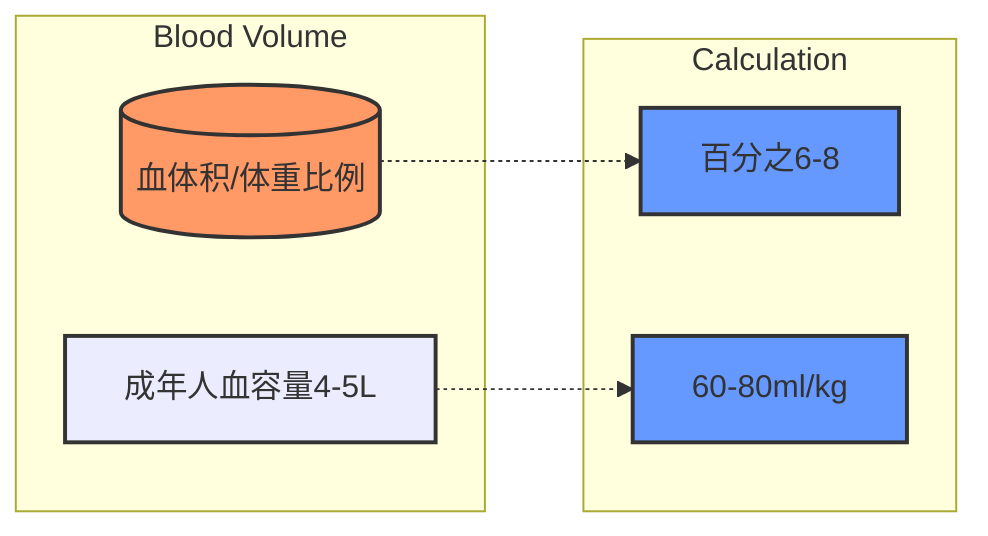
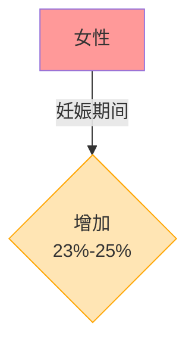
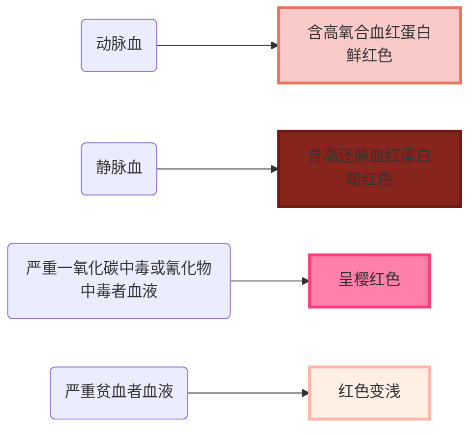
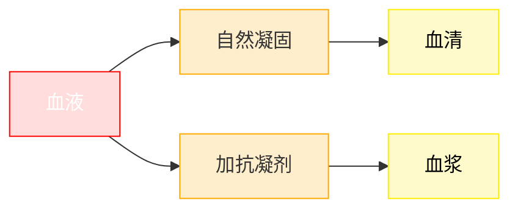

# 【1】血液生理概要

<kaodian :text="'临床检验基础记忆卡'" />

<!-- ###### 一款可刷题的记忆小程序 -->

<!-- > 献于医学检验考生 -->

<beitiL/>

<!--  -->

---

## (1)血液组成

<son :text="'临床检验基础检验记忆卡'" text1="(1)血液组成" :textOption="[['了解','基础知识','相关专业知识'],['掌握','基础知识','相关专业知识'],['掌握','基础知识','相关专业知识']]" />
::::tip

:::details 图片记忆





:::

```js
正常人血量约为`（70±10）`ml／kg，成人约`4～5L`，约占体重的`6%～8%`，其中血浆占`55%`，血细胞占`45%`。

小儿血量与体重之比略高于成人.男性比女性血量稍多.但女性`妊娠期间`🤰血量可增加`23%～25%`。
```

::::

## (2)血液理化性质

<son :text="'临床检验基础检验记忆卡'" text1="(2)血液理化性质" :textOption="[['了解','基础知识','相关专业知识'],['了解','基础知识','相关专业知识'],['了解','基础知识','相关专业知识']]" />

::::tip
:::details 图片记忆



:::

::: code-group

```js [颜色]
动脉血`氧合血红蛋`白含量较高，
呈`鲜`红色;静脉血还原血红蛋白含量高，呈`暗`红色。
严重`一氧化碳中毒或氰化物`中毒者血液呈`樱`🍒红色。// [!code focus]
严重贫血者血液红色变浅。
血液的红色来自红细胞内血红蛋白。
```

```js [酸碱度]
pH 值 `7.35 ～ 7.45`，
动脉血 pH 值 `7.40`，
静脉血 pH 值 `7.35`。
```

```js [血浆渗透量]
正常人约为 `290 ～ 310mOsm／（kg·H20）`{二舅👨‍🦰三姨👩‍🦳}
```

```js [黏稠度]
正常人血液中红细胞呈均匀混悬状态。与红细胞膜表面的唾液酸根、正常血浆成分、
血浆黏度及血流动力学等因素有关。
正常人全血黏度约为生理盐水黏度的 4 ～ 5 倍，
血浆黏度约为生理盐水黏度的 1.6 倍。
血液黏度与血细胞比容和血浆黏度有关.
其中，血浆黏度受血浆中
`纤维蛋白原`、`球蛋白`⚽️//这是正确选项 // [!code ++]
`激素`//这是干扰项 // [!code --]
等大分子蛋白质的影响，
它们的浓度越高，血浆黏度越高.
```

:::
::::

## (3)血液特性

<son :text="'临床检验基础检验记忆卡'" text1="(3)血液特性" :textOption="[['了解','基本知识','专业知识'],['了解','基本知识','相关专业知识'],['了解','基本知识','相关专业知识']]" />

:::: tip

:::details 图片记忆



:::

血液`自然`凝固，分离出来的淡黄色透明液体称为`血清`。
血液加`抗凝剂`，分离出来的淡黄色液体称为`血浆`。

::: code-group

```js [全血]
适用于临床血液学检查，如`血细胞计数、分类和形态学检查`等
```

```js [血浆]
适用于血浆生理性和病理性`化学成分`的测定，
特别是`内分泌激素`测定；// [!code focus]
血浆除钙离子外，含有其他全部凝血因子，
也适用于`血栓与止血`的检查。
```

```js [血清]
适用于临床`化学`和临床`免疫`学检查。
```

:::

::::

:::: warning
血清与血浆差别是：
血清缺少某些凝血因子，如`凝血因子Ⅰ（纤维蛋白原）、Ⅱ（凝血酶原）、Ⅴ、Ⅷ`等.
{`1你、2❤️、5我、8吧`}。
::::

## (4)血液生理功能

<son :text="'临床检验基础检验记忆卡'" text1="(4)血液生理功能" :textOption="[['了解','基本知识','专业知识'],['掌握','基本知识','相关专业知识'],['掌握','基本知识','相关专业知识']]" />

::::tip 血液生理功能具有

:::details 图片记忆


:::

```js

`运输功能`、🚛

`协调功能`、👨‍🔬

`维护机体内环境稳定`👮‍♀️

`防御功能`🛡️
```

::::
