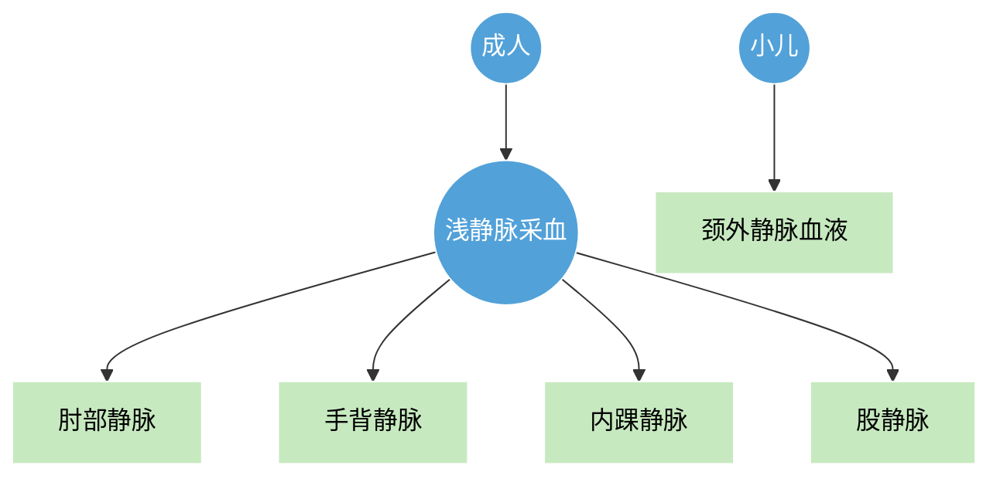
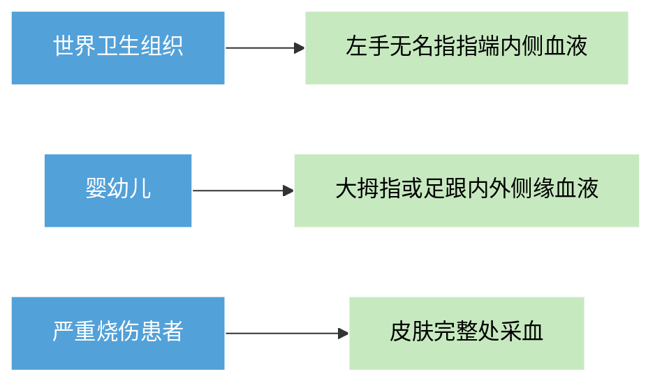
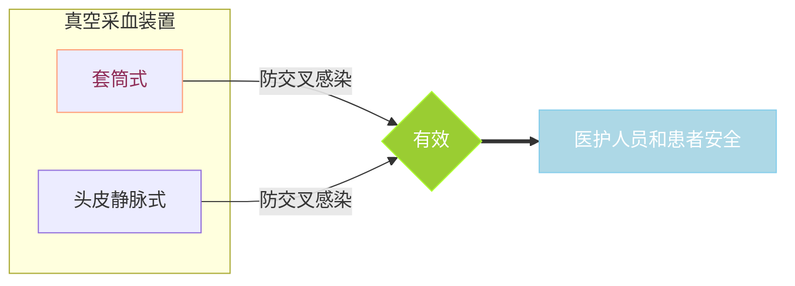
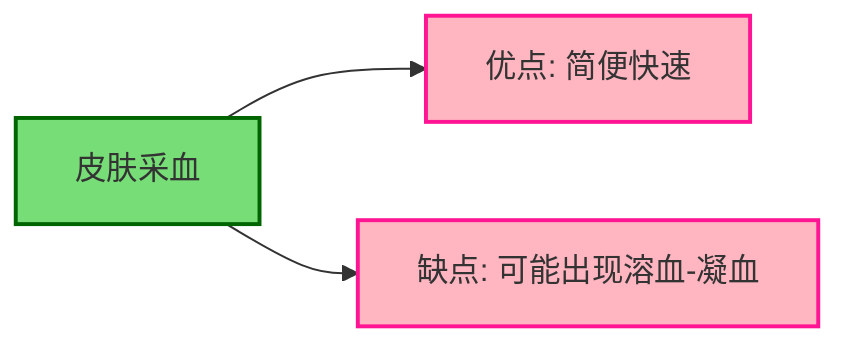

# 【2】采血方法

<kaodian :text="'临床检验基础记忆卡'" />

<!-- ###### 第一章 血液样本采集和血涂片制备 -->

<!-- > 临床检验基础 -->

<beitiL/>

---

## （1）静脉采血法

<son :text="静脉采血法"  :textOption="[['熟练掌握','专业知识','基础知识'],['了解','专业知识','基础知识'],['了解','专业知识','基础知识']]" />

::::tip

:::details 图片记忆



:::

```JS
成人静脉采血多采用位于体表的浅静脉，通常采用肘部静脉、手背静脉、内踝静脉或股静脉。

小儿可采`颈外静脉血液`。
```

::::

## （2）皮肤采血法

<son :text="皮肤采血法"  :textOption="[['熟练掌握','专业知识','基础知识'],['了解','专业知识','基础知识'],['了解','专业知识','基础知识']]" />

::::tip

:::details 图片记忆



:::

```JS
皮肤采血法曾称为毛细血管采血法，
是采集微动脉、微静脉和毛细血管的混合血，同时含细胞间质和细胞内液。
通常，选择耳垂或手指部位。手指采血操作方便，检查结果比较恒定。

世界卫生组织（WHO）推荐采集`左手无名指指端内侧`血液.
婴幼儿👶可采集`大拇指或足跟内外侧`缘血液.
严重烧伤患者，可选择`皮肤完整处`采血。
```

::::

## （3）真空（负压）采血法

<son :text="静脉采血法"  :textOption="[['熟练掌握','专业知识','基础知识'],['了解','专业知识','基础知识'],['了解','专业知识','基础知识']]" />

::::tip

:::details 图片记忆



:::

```js
真空采血装置有套筒式和头皮静脉式两种，
能有效避免医护人员和患者间 `交叉感染`🙅🏼‍♀️。
各种真空定量采血容器，根据需要标有不同的色码，适于不同检验项目。
```

::::

## （4）方法学评价和质量控制

<son :text="静脉采血法"  :textOption="[['熟练掌握','专业知识','基础知识'],['了解','专业知识','基础知识'],['了解','专业知识','基础知识']]" />

::::tip

:::details 图片记忆



:::

:::code-group

```js [皮肤采血]
优点:简便快速，
缺点：但容易出现`溶血`🩸、// [!code focus]
凝血、混入组织液，从而影响检查结果。
```

```js [静脉采血]
① 开放式采血法的操作环节多、难于规范统一，在移液和丢弃注射器时可能造成血液污染。

② 封闭式采血法的操作规范，有利于样本收集运送和保存，防止院内血源性传染病。
```

:::

::::
