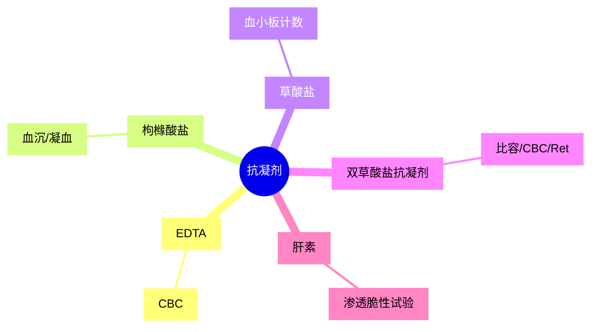

# 【3】抗凝剂选择

<kaodian :text="'临床检验基础记忆卡'" />

<!-- ###### 第一章 血液样本采集和血涂片制备 -->

<!-- > 临床检验基础 -->

<beitiL/>

---

## (1)乙二胺四乙酸（EDTA）盐

<son :text="'临床检验基础检验记忆卡'" text1="(1)乙二胺四乙酸（EDTA）盐" :textOption="[['掌握','基础知识','相关专业知识'],['掌握','基础知识','专业知识'],['熟练掌握','基础知识','专业知识']]" />

:::details 图片记忆



:::

::::tip
常用有钠盐（EDTA-Na2·H20）或钾盐（EDTA-K2·2H2O）

```js
原理:
能与血液中`钙离子结合成螯合物`，使Ca2＋失去凝血作用，阻止血液凝固。// [!code ++]

EDTA 盐对`血细胞形态`、血小板计数影响很小，适用于血液学检查，尤其是血小板计数。
但钠盐溶解度低于钾盐，有时影响抗凝效果。

根据国际血液学标准化委员会（ICSH）建议，
CBC 抗凝剂用 EDTA-K2·2H2O，量为 1.5 ～ 2.2mg／ml 血液。

不适用:
`凝血检查、血小板`功能试验。

用`自动血液分析仪`时，首选的抗凝剂`EDTA-K₂`.

````

::::

## (2.1)草酸盐

<son :text="'临床检验基础检验记忆卡'" text1="(2.1)草酸盐" :textOption="[['掌握','基础知识','相关专业知识'],['掌握','基础知识','专业知识'],['熟练掌握','基础知识','专业知识']]" />

::::tip

常用有草酸钠、草酸钾、草酸铵.

```js

原理:
溶解后解离的草酸根离子能与样本中`钙离子形成草酸钙沉淀`，
使Ca2＋失去凝血作用，阻止血液凝固。

草酸盐优点是溶解度好、价廉。

不适用:
草酸盐对凝血因子V的保护作用差，影响凝血酶原时间测定，
而且草酸盐与钙结合后形成的沉淀物，影响自动凝血仪检测结果，
因此，草酸盐`不适于凝血检查`。
````

::::

## (2.2)双草酸盐抗凝剂

<son :text="'临床检验基础检验记忆卡'" text1="(2.2)双草酸盐抗凝剂" :textOption="[['掌握','基础知识','相关专业知识'],['掌握','基础知识','专业知识'],['熟练掌握','基础知识','专业知识']]" />

::::tip

```js
适用:
草酸钾可使红细胞体积缩小，草酸铵则可使红细胞胀大，
两者按适当比例混合，恰好不影响红细胞形态和体积.
可用于`血细胞比容、CBC、网织红细胞计数`等项目检查.

若单用草酸钾或草酸钠作为抗凝剂，与肝素为抗凝剂测定的血细胞比容比较，
测定结果可减低8%～13%。

不适用:
双草酸盐抗凝剂可使`血小板聚集、影响白细胞形态`，
不适于`血小板计数、白细胞分类计数`。
```

::::

## (3)肝素

<son :text="'临床检验基础检验记忆卡'" text1="(3)肝素" :textOption="[['掌握','基础知识','相关专业知识'],['掌握','基础知识','专业知识'],['熟练掌握','基础知识','专业知识']]" />

::::tip

```js
原理:
加强抗`凝血酶（AT）灭活丝氨酸蛋白酶`作用.
阻止凝血酶的形成，并阻止血小板聚集等作用，从而阻止血液凝固。

适用:
肝素广泛存在于肺、肝、脾等几乎所有组织和血管周围肥大细胞和嗜碱性粒细胞颗粒中，
带有较多负电荷。
肝素具有抗凝力强、不影响血细胞体积、不易溶血等优点，
绝大多数检查都可用肝素作为抗凝剂，是红细胞渗透脆性试验的理想抗凝剂。

不适用:
但肝素可引起白细胞聚集，瑞氏染色后产生蓝色背景，
每毫升血液肝素用量为（15±2.5）U，多为肝素钠盐或钾盐。
`不适于CBC`、细胞形态学检查。
```

::::

## (4)枸橼酸盐

<son :text="'临床检验基础检验记忆卡'" text1="(4)枸橼酸盐" :textOption="[['掌握','基础知识','相关专业知识'],['掌握','基础知识','专业知识'],['熟练掌握','基础知识','专业知识']]" />

::::tip

```js
原理:
常用有枸橼酸钠，能与血液中钙离子结合形成螯合物，

阻止血液凝固。枸橼酸盐的溶解度低，抗凝力不如上述抗凝剂。
枸橼酸钠与血液的抗凝比例为`1：9或1：4`。

适用:
红细胞沉降率、凝血检查，是输血保养液的成分。
```

::::

| 抗凝剂 | 1.EDTA     | 2.草酸盐     | 3.双草酸盐抗凝剂 | 4.肝素       | 5.枸橼酸盐 |
| ------ | ---------- | ------------ | ---------------- | ------------ | ---------- |
| 原理   | (钙)螯合物 | 草酸钙沉淀   | 草酸钙沉淀       | 抗凝血酶III（AT-III）         | (钙)螯合物 |
| 适用   | CBC        | `血小板计数` | 比容、CBC、Ret   | 渗透脆性试验 | 血沉/凝血  |
