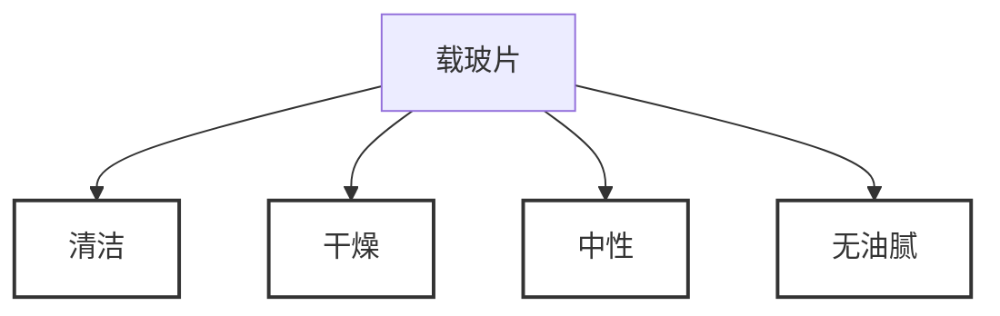
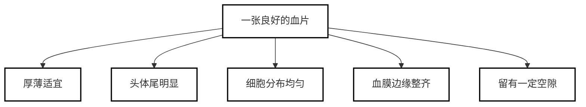

# 【4】血液涂片制备

<kaodian :text="'临床检验基础记忆卡'" />

<!-- ###### 第一章 血液样本采集和血涂片制备 -->

<!-- > 临床检验基础 -->

<beitiL/>

## (1)载玻片的清洁

<son :text="'临床检验基础检验记忆卡'" text1="(1)载玻片的清洁" :textOption="[['掌握','相关专业知识','专业实践能力'],['掌握','专业知识','专业实践能力'],['掌握','专业知识','专业实践能力']]" />
::::tip

:::details 图片记忆



:::

```js
玻片清洗新载玻片常带有游离碱质，须用1mol/L HCl浸泡24h，清水冲洗。

载玻片应清洁、干燥、中性、无油腻。
```

::::

## (2)血涂片的制备

<son :text="'临床检验基础检验记忆卡'" text1="(2)血涂片的制备" :textOption="[['熟练掌握','相关专业知识','专业实践能力'],['掌握','专业知识','专业实践能力'],['掌握','专业知识','专业实践能力']]" />

::::tip

:::details 图片记忆



:::
取血`1滴`置载玻片一端，以边缘平滑的推片，从血滴前方接触血液，使血液沿推片散开，通常推片与载玻片保持`25°～30°`夹角，平稳地向前推动，血液即在载玻片上形成薄层血膜。

```js
1. 涂片厚薄与血滴大小、推片与载玻片间夹角、推片速度、血细胞比容有关。

2. 一张良好的血片，应厚薄适宜、头体尾明显、细胞分布均匀、血膜边缘整齐，并留有一定空隙。

干扰项：`❌血膜长度占载玻片长度的 3/4 左右` // [!code error]

```

::::
