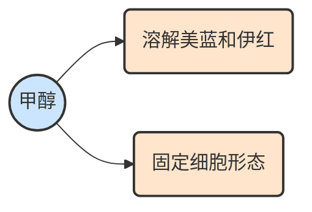
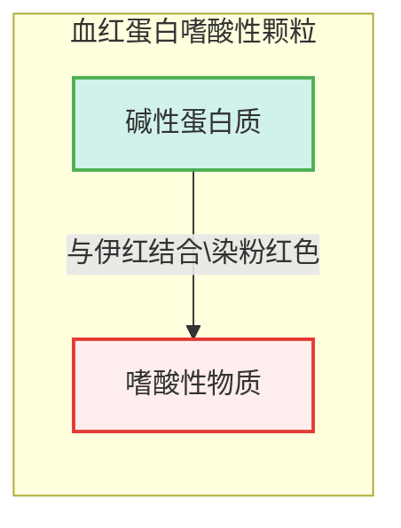
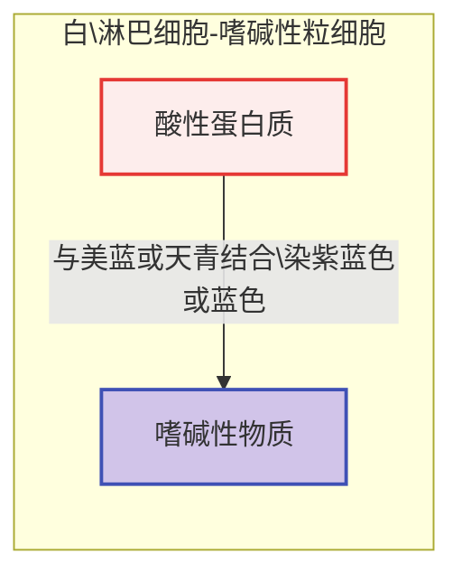
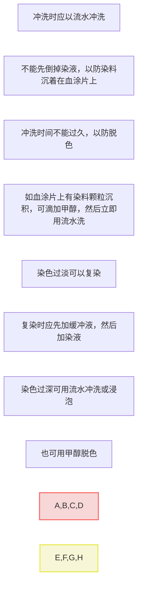
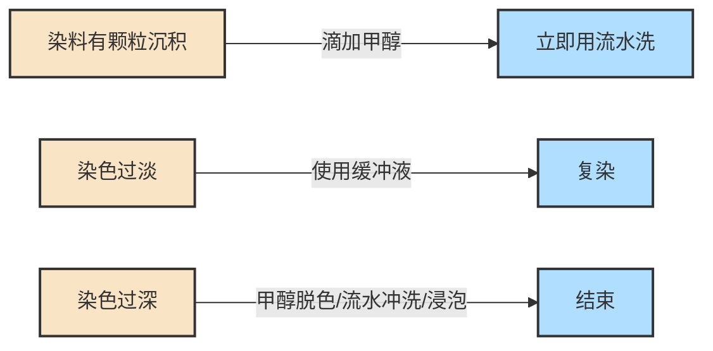
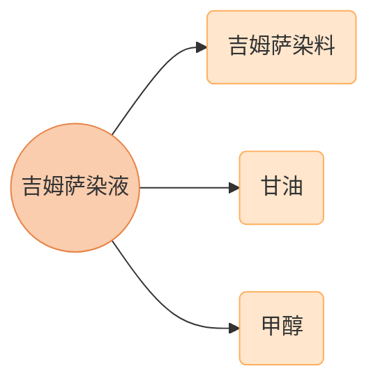

# 【5】血液细胞染色

<kaodian :text="'临床检验基础记忆卡'" />

<!-- ###### 第一章 血液样本采集和血涂片制备 -->

<!-- > 临床检验基础 -->

<beitiL/>

---

## (1)瑞氏染色法

<son :text="'临床检验基础检验记忆卡'" text1="(1)瑞氏染色法" :textOption="[['熟练掌握','相关专业知识','专业实践能力'],['熟练掌握','专业知识','专业实践能力'],['掌握','专业知识','专业实践能力']]" />
> 将适量`酸性染料伊红（E－）`和`碱性染料亚甲蓝（M＋）溶解在`甲醇`中，即为瑞氏染料。

::::tip

:::details 图片记忆



:::

### 1.1 甲醇的作用

```js
1. `溶解`🫠美蓝和伊红；

2. `固定`🧷细胞形态。

```

::::

::::tip

:::details 图片记忆





:::

### 1.2 染色原理

既有物理的`吸附`作用，又有化学的`亲和`👄 作用。各种细胞成分化学性质不同，对各种染料的亲和力也不一样。

```js
如`血红蛋白`、嗜酸性颗粒为`碱性蛋白质`，
与酸性染料伊红结合，染粉红色，称为嗜酸性物质；

细胞`核蛋白、淋巴细胞`、嗜碱性粒细胞胞质为`酸性蛋白质`，
与碱性染料美蓝或天青结合，染紫蓝色或蓝色，称为嗜碱性物质。

中性颗粒呈等电状态与伊红和美蓝均可结合，染淡紫红色，称为嗜中性物质；

原始红细胞、早幼红细胞胞质、核仁含较多酸性物质，染成较浓厚的蓝色；
中幼红细胞既含酸性物质，又含碱性物质，染成红蓝色或灰红色；
完全成熟红细胞，酸性物质彻底消失后，染成粉红色。
```

::::

::::tip

### 1.3 影响因素

:::details 表格记忆
| pH环境 | 电荷变化 | 结合染色 | 细胞染色 | 核染色 |
| :----: | :------: | :------: | :------: | :----: |
| 酸性   | 正电荷增多 | 伊红    | 偏红    | 淡蓝色或不染色 |
| 碱性   | 负电荷增多 | 美蓝    | 灰蓝色  | 紫黑色或深暗 |

:::

```js
pH值的影响：

  细胞各种成分均属蛋白质，由于蛋白质系两性电解质，所带电荷随溶液pH而定。

  在偏`酸性`环境中正电荷增多，易与`伊红`结合，红细胞和嗜酸性粒细胞染色`偏红`，细胞核呈淡蓝色或不染色；

  在偏`碱性`环境中负电荷增多，易与美蓝结合，所有细胞呈`灰蓝色`，颗粒呈深暗，嗜酸性颗粒呈暗褐，甚至棕黑色，中性颗粒偏粗，呈紫黑色。

 稀释染液必须用缓冲液，冲洗用水应近中性，
 否则可导致细胞染色反应呈色异常，形态难以识别，甚至错误。

```

::::



::::tip

:::details 图片记忆



:::

### 1.4 注意事项

```js
1. 冲洗时应以`流水`冲洗，不能先倒掉染液，以防`染料沉着`在血涂片上。

2. 冲洗时间不能过久，以防脱色。

3. 染料有`颗粒沉积`，可滴加`甲醇`，然后立即用流水洗。

4. 染色`过淡`，可用`缓冲液`复染。

5. 染色`过深`,可用`甲醇脱色`或流水冲洗或浸泡。
```

::::

## (2)吉姆萨染色法

<son :text="'临床检验基础检验记忆卡'" text1="(2)吉姆萨染色法" :textOption="[['了解','相关专业知识','专业实践能力'],['掌握','专业知识','专业实践能力'],['掌握','专业知识','专业实践能力']]" />

> 吉姆萨染料由`天青`、`伊红`组成。

::::tip

:::details 图片记忆



:::

:::code-group

```js[原理]
2.1 原理:
染色原理和结果与瑞氏染色基本相同。
```

```js[染色方法和注意事项]
2.2 染色方法和注意事项:
1. 需先用甲醇固定`3～5min`。
2. 吉姆萨染液由吉姆萨染料、甘油和甲醇组成。
3. 染色前，用磷酸盐缓冲液（pH6.4 ～ 6.8）稀释吉姆萨染 10 ～ 20 倍。

```

:::

::::
