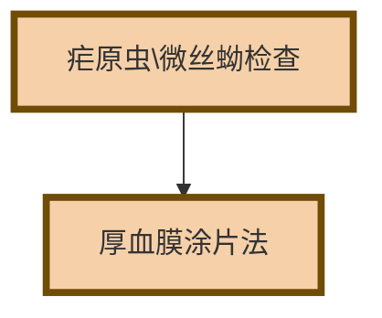

# 【6】方法学评价

<kaodian :text="'临床检验基础记忆卡'" />

<!-- ###### 第一章 血液样本采集和血涂片制备 -->

<!-- > 临床检验基础 -->

<beitiL/>

---

## (1)血涂片制备

<son :text="'临床检验基础检验记忆卡'" text1="(1)血涂片制备" :textOption="[['了解','相关专业知识','专业实践能力'],['了解','专业知识','专业实践能力'],['掌握','专业知识','专业实践能力']]" />
::::tip

:::details 图片记忆



:::

```js
血涂片制备:
`手工推片法`用血量少、操作简单，是应用最广泛的方法。

此外，疟原虫、微丝蚴等检查可采用`厚血膜涂片法`。
```

::::

## (2)血液细胞染色

<son :text="'临床检验基础检验记忆卡'" text1="(2)血液细胞染色" :textOption="[['了解','相关专业知识','专业实践能力'],['了解','专业知识','专业实践能力'],['掌握','专业知识','专业实践能力']]" />
::::tip

:::details 表格记忆
| 巴氏染色法       | HE 染色 | 吉姆萨染       | 瑞氏染色 | 吉姆萨复合染色法 |
| ---------------- | ------- | -------------- | -------- | ---------------- |
| 泌尿系统肿瘤细胞 | 癌细胞  | 细胞核、寄生虫 | 细胞质   | 胞质、胞核       |
| 妇科推片         |         |                | 临床常用 | 复合染料         |

:::

:::code-group

```js [瑞氏染色法]
最经典、最常用的染色法，尤其对于`细胞质成分、中性颗粒`等
可获得很好的染色效果，但对细胞核的着色能力略差。
```

```js [吉姆萨染色法]
对`细胞核、寄生虫（如疟原虫等）`着色较好，结构更清晰，
但对细胞质成分的着色能力略差。
```

```js [瑞氏-吉姆萨复合染色法]
使细胞胞质、颗粒、胞核等`均`获得满意的染色效果。
```

:::

::::

<!--endPrint-->
