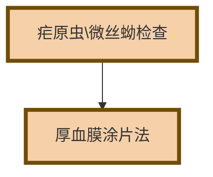

# 【6】方法学评价

<kaodian :text="'临床检验基础记忆卡'" />

<beitiL/>

---

## (1)血涂片制备

<son :text="'临床检验基础检验记忆卡'" text1="(1)血涂片制备" :textOption="[['了解','相关专业知识','专业实践能力'],['了解','专业知识','专业实践能力'],['掌握','专业知识','专业实践能力']]" />
::::tip

:::details 图片记忆



:::

```js
血涂片制备:
`手工推片法`用血量少、操作简单，是应用最广泛的方法。

此外，疟原虫、微丝蚴等检查可采用`厚血膜涂片法`。
```

::::

## (2)血液细胞染色

<son :text="'临床检验基础检验记忆卡'" text1="(2)血液细胞染色" :textOption="[['了解','相关专业知识','专业实践能力'],['了解','专业知识','专业实践能力'],['掌握','专业知识','专业实践能力']]" />
::::tip

:::details 表格记忆

| 染色方法         | 应用领域       | 描述                                                         |
| ---------------- | -------------- | ------------------------------------------------------------ |
| **巴氏染色法**   | 泌尿系统肿瘤细胞、妇科推片 | 巴氏染色可以清晰地显示细胞的形态和结构，对于诊断各种肿瘤和炎症疾病非常有用。 |
| **HE染色**       | 癌细胞         | HE染色可以清晰地显示细胞的形态和结构。                       |
| **吉姆萨染色**   | 细胞核、寄生虫 | 吉姆萨染色可以清晰地显示细胞核的形态和结构，对于诊断各种寄生虫疾病非常有用。 |
| **瑞氏染色**     | 细胞质         | 瑞氏染色可以清晰地显示细胞质的形态和结构，对于诊断各种疾病非常有用。 |
| **吉姆萨复合染色法** | 胞质、胞核     | 这种染色方法使用了**复合染料**，可以在一个步骤中完成多种染色，大大提高了工作效率。 |

:::

:::code-group

```js [瑞氏染色法]
最经典、最常用的染色法，尤其对于`细胞质成分、中性颗粒`等
可获得很好的染色效果，但对细胞核的着色能力略差。
```

```js [吉姆萨染色法]
对`细胞核、寄生虫（如疟原虫等）`着色较好，结构更清晰，
但对细胞质成分的着色能力略差。
```

```js [瑞氏-吉姆萨复合染色法]
使细胞胞质、颗粒、胞核等`均`获得满意的染色效果。
```

:::

::::
