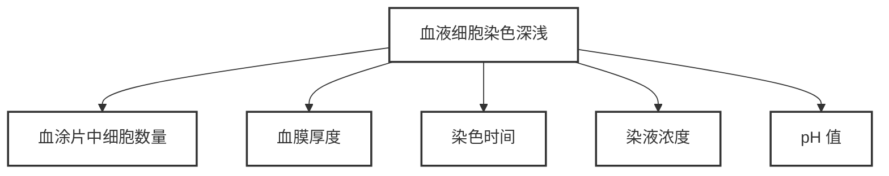

# 【7】质量控制

<kaodian :text="'临床检验基础记忆卡'" />

<!-- ###### 第一章 血液样本采集和血涂片制备 -->

<!-- > 临床检验基础 -->

<beitiL/>

---

## (1)血涂片制备

<son :text="'临床检验基础检验记忆卡'" text1="(1)血涂片制备" :textOption="[['了解','相关专业知识','专业实践能力'],['掌握','专业知识','专业实践能力'],['熟练掌握','专业知识','专业实践能力']]" />

::::tip

:::details 记忆技巧 💡

:::warning
血滴-夹角-速度-比容:`越大越厚、越小越薄`

:::

```js
制备涂片时,`血滴愈大`🩸、`角度愈大`🦶、// [!code focus]
推片`速度愈快`✈️，`血膜愈厚`🐒，反之则愈薄。// [!code focus]

血细胞比容增高、血液黏度较高时，应采用小血滴、小角度、慢推，可得满意结果；

血细胞比容减低、血液较稀时，应采用大血滴、大角度、快推。
```

::::

## (2)血液细胞染色

<son :text="'临床检验基础检验记忆卡'" text1="(2)血液细胞染色" :textOption="[['了解','相关专业知识','专业实践能力'],['掌握','专业知识','专业实践能力'],['熟练掌握','专业知识','专业实践能力']]" />
::::tip

:::details 图片记忆



:::

```js
血液细胞染色深浅与血涂片中细胞数量、血膜厚度、染色时间、染液浓度、pH 值密切、相关。

混淆选项：`❌室温`、`❌血细胞形态` // [!code --]
```

::::
