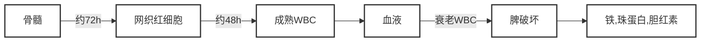
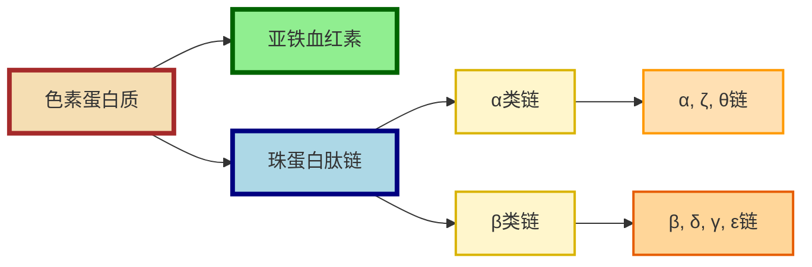

# 【1】概要

<kaodian :text="'临床检验基础记忆卡'" />

<!-- ###### 第二章 红细胞检查

> 临床检验基础 -->

<beitiL/>

---

## (1)红细胞生理

<son :text="'临床检验基础检验记忆卡'" text1="(1)红细胞生理" :textOption="[['了解','基础知识','专业知识'],['了解','基础知识','相关专业知识'],['掌握','基础知识','相关专业知识']]" />

::::tip
:::details 图片记忆



:::
红细胞是血液中数量最多的有形成分，起源于`骨髓造血干细胞`，在红细胞生成素作用下，经红系祖细胞阶段，分化为原红细胞，经数次有丝分裂发育为早幼、中幼和晚幼红细胞。

```js
晚幼红细胞通过脱核成为网织红细胞，
这一过程在`骨髓`中进行，约需`72h`。

网织红细胞经约48h成完全成熟的红细胞，释放入血液，
平均寿命约`120d`，衰老红细胞主要`在脾破坏`，
分解为`铁、珠蛋白和胆红素。`
```

::::

## (2)血红蛋白

<son :text="'临床检验基础检验记忆卡'" text1="(2)血红蛋白" :textOption="[['了解','基础知识','专业知识'],['了解','基础知识','相关专业知识'],['了解','基础知识','相关专业知识']]" />
血红蛋白分子是有核红细胞、网织红细胞内形成的一种含色素蛋白质。色素部分为`亚铁血红素`，蛋白质部分为`珠蛋白`。

::::tip

:::details 图片记忆



:::

:::code-group

```js[亚铁血红素]
1. 亚铁血红素:
由原卟啉、铁组成，受 δ-氨基-γ 酮戊酸合成酶、血红素和 Fe2 ＋的调节。
```

```js[珠蛋白]
2. 珠蛋白:
珠蛋白肽链分为α、β两类

1. α类链：α，ζ和θ链
2. β类链：β，δ，γ，ε链

α链由141个氨基酸组成，β链由146个氨基酸组成。
每个Hb分子由2条α类肽链和2条β类肽链组成。
```

```js[蛋白与铁结合]
3. 蛋白与铁结合
在正常情况下，99%Hb的铁原子呈`Fe2＋`状态，称为`还原Hb`。
1%呈`Fe3＋`状态，称为`高铁血红蛋白`。
```

```js[血红蛋白的合成受激素的调节]
4. 血红蛋白的合成受激素的调节:
1. 红细胞生成素`【主要】`：
可促进δ-氨基-γ酮戊酸生成和铁的利用，从而促进血红素、Hb的合成；

1. 雄激素：
能促进δ-氨基-γ酮戊酸合成酶、红细胞生成素的生成。
```

```js[Hb种类]
5. Hb 种类与比例不同:
在胚胎发育早期，约妊娠第5周，ζ与ε基因表达，
形成个体发育中第一个有功能的胚胎期血红蛋白：ζ2ε2（Hb GowerⅠ）；

妊娠第6周，α和γ基因开始表达，形成Hb GowerⅠ（ζ2ε2）、
Hb GowerⅡ（α2ε2）、Hb Portland（ζ2γ2）和HbF（α2γ2）等胚胎期血红蛋白；

妊娠第8周，γ链合成达到最高峰，β链开始合成，形成HbA（α2β2）。

妊娠第36周，β链合成迅速增加，γ链合成速率减低；刚出生时，
β链与γ链合成量大致相等；

出生后3个月，使HbA逐步占Hb总量95%以上，而HbF逐步降至1%以下。
δ链开始合成时间不很清楚，出生后HbA2（α2δ2）占Hb总量的2%～3%。
```

::::

:::warning 提示
只有Fe2＋状态的Hb才能`与氧结合`，称为`氧合血红蛋白`,`【外周血中主要的Hb】`。
:::
