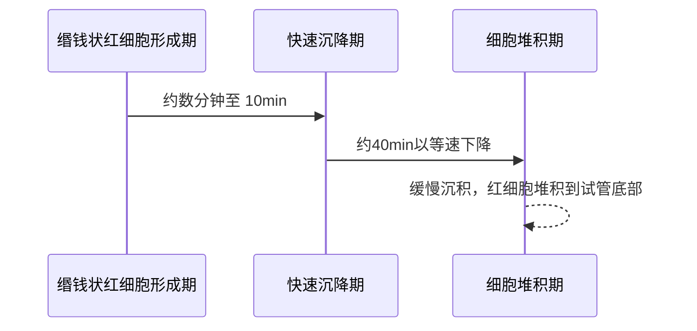
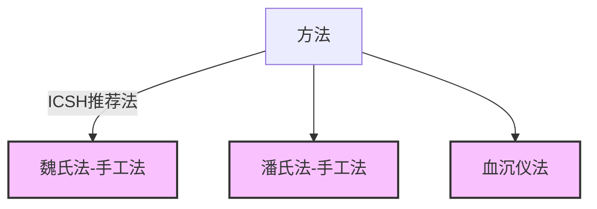
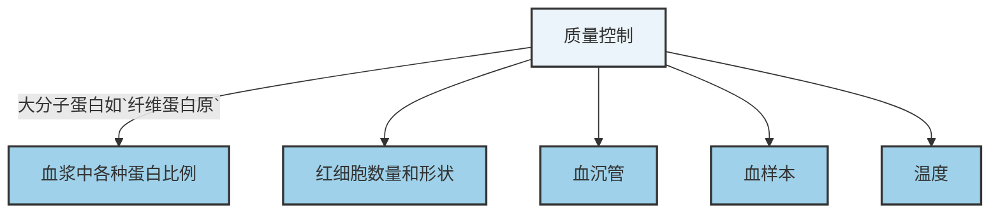
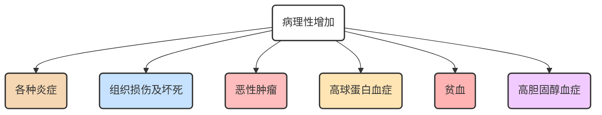

# 【10】红细胞沉降率测定

<kaodian :text="'临床检验基础记忆卡'" />

<beitiL/>

---

## (1)检测原理

<son :text="'临床检验基础检验记忆卡'" text1="(1)检测原理" :textOption="[['掌握','基础知识','相关专业知识'],['掌握','基础知识','专业知识'],['了解','基础知识','专业知识']]" />

::::tip

:::details 图片记忆



:::
红细胞沉降率（ESR，血沉）指离体抗凝血静置后，红细胞在单位时间内沉降的速度。

:::code-group

```js[魏氏(Westergren）法]
1.魏氏(Westergren）法:
  将枸橼酸钠抗凝血置于特制的刻度血沉管内，在室温下垂直立于血沉架 1 小时后，读取上层血浆的高度，即为红细胞沉降率。
血沉测定实际上是测量`单位时间内红细胞下沉后血浆段的高度`，而并非真正红细胞沉降的速度。
```

```js[自动血沉仪法]
1. 自动血沉仪法:
  动态红细胞下沉分为 3 个阶段：
  ① 红细胞缗钱样聚集期，约数分钟至 10 min；
  ② 红细胞快速沉降期，聚集逐渐减弱，`缗钱状红细胞`以等速下降，约 40 min；
  ③ 红细胞堆积期（缓慢沉积期），约 10 分钟，红细胞堆积到试管底部。

  全自动血沉仪根据红细胞下沉过程中血浆浊度的改变，采用光电比浊法、
  红外线扫描法或摄影法，动态分析红细胞下沉各个时段血浆的透光度，
  以微电脑记录并打印结果。
```

:::
::::

## (2)方法学评价

<son :text="'临床检验基础检验记忆卡'" text1="(2)方法学评价" :textOption="[['了解','相关专业知识','专业实践能力'],['了解','专业知识','专业实践能力'],['熟练掌握','专业知识','专业实践能力']]" />

::::tip

因抗凝剂、用血量、血沉管规格、观察时间不同，所以各种方法参考值不同。

:::details 图片记忆



:::
:::code-group

```js[魏氏法（手工法）]
2.1 魏氏法(手工法)

简便实用，为`ICSH推荐法`，需用专用的魏氏血沉管，内径为`2.5mm`。
```

```js[潘氏法(手工法)]
2.2 潘氏法(手工法)

用血量少（适用于儿童）。
```

```js[血沉仪法]
2.3 血沉仪法

仪器测量时间短、重复性好、不受环境温度影响等。

```

:::
::::

## (3)质量控制

<son :text="'临床检验基础检验记忆卡'" text1="(3)质量控制" :textOption="[['了解','相关专业知识','专业实践能力'],['掌握','专业知识','专业实践能力'],['了解','专业知识','专业实践能力']]" />

::::tip

:::details 图片记忆



:::
:::code-group

```js[血浆中各种蛋白比例]
3.1 血浆中各种蛋白比例
小分子蛋白如清蛋白、卵磷脂等使血沉减缓，大分子蛋白如`纤维蛋白原`、急性
反应蛋白、免疫球蛋白、巨球蛋白、胆固醇、甘油三酯、等使血沉加快。
`【干扰项：糖蛋白】`
```

```js[红细胞数量和形状]
3.2 红细胞数量和形状
（1）红细胞数量
数量减少使血沉加快，数量增多使血沉减慢。但数量太少，血沉也减慢。
（2）红细胞直径
直径越大血沉越快，球形红细胞、镰形红细胞使血沉减慢。
```

```js[血沉管]
3.3 血沉管
血沉管应完全直立，若血沉管倾斜 3°，沉降率增加 30%。
```

```js[血样本]
3.4 血样本
抗凝剂浓度增加、血液凝固使血沉减慢。
```

```js[温度]
3.5 温度
室温过`高`使血沉加`快`，室温过低使血沉减慢。
```

:::
::::

> 影响红细胞缗钱状形成的主要因素`【不包括枸橼酸钠抗凝剂】`

## (4)参考区间

<son :text="'临床检验基础检验记忆卡'" text1="(4)参考区间" :textOption="[['掌握','专业知识','专业实践能力'],['掌握','相关专业知识','专业实践能力'],['掌握','相关专业知识','专业实践能力']]" />

::::tip

```js
魏氏法：

男性 `0 ～ 15mm/h`

女性 0 ～ 20mm/h
```

::::

## (5)临床意义

<son :text="'临床检验基础检验记忆卡'" text1="(5)临床意义" :textOption="[['了解','专业知识','专业实践能力'],['掌握','相关专业知识','专业实践能力'],['熟练掌握','相关专业知识','专业实践能力']]" />

::::tip

#### 5.1 生理性血沉增快

```js[生理性]
（1）生理性
女性高于男性。妇女月经期、妊娠 3 个月以上者血沉增快。老年人血沉增快。
```

#### 5.2病理性血沉增快

:::details 图片记忆



:::
:::code-group


```js[各种炎症]
1) 各种炎症
急性细菌性炎症
  如 α1 胰蛋白酶、α2 巨球蛋白、C 反应蛋白、转铁蛋白、纤维蛋白原等急性期反应物增多，2 ～ 3d 后血沉增快。
慢性炎症
  如结核病、结缔组织炎症、风湿热等，活动期血沉增快，病情好转血沉减慢，
  非活动期血沉正常。
```

```js[组织损伤及坏死]
2）组织损伤及坏死
组织损伤、手术创伤使血沉增快，若无并发症，2 ～ 3 周内恢复正常。
心肌梗死 2 ～ 3d 后血沉增快，持续 1 ～ 3 周，而心绞痛血沉正常。
```

```js[恶性肿瘤]
3）恶性肿瘤
因 α2 巨球蛋白、纤维蛋白原增高、肿瘤组织坏死、继发感染、
贫血等因素使血沉增快。手术切除、治疗好转，血沉可正常。
复发或转移时，血沉又增快。良性肿瘤血沉多正常。
```

```js[高球蛋白血症]
4）高球蛋白血症
如`系统性红斑狼疮`、恶性淋巴瘤、亚急性感染性心内膜炎、肝硬化、
慢性肾炎等`血沉增快`。如多发性骨髓瘤、巨球蛋白血症血沉正常或减慢。
```

```js[贫血]
5）贫血
贫血使血沉轻度增快。遗传性红细胞增多症、镰形细胞性贫血、
红细胞异形症等血沉可减慢。
```

```js[高胆固醇血症]
6）高胆固醇血症
如动脉粥样硬化、糖尿病、肾病综合征、黏液性水肿、
原发性家族性高胆固醇血症等血沉增快。
```

::::
::::tip

### 5.2 血沉减慢

```js
如真性或相对性红细胞增多症、DIC 消耗性低凝血期、继发性纤溶期等血沉减慢。
```

::::

---

## (6)操作方法

<son :text="'临床检验基础检验记忆卡'" text1="(6)操作方法" :textOption="[['熟练掌握','相关专业知识','专业实践能力'],['掌握','专业知识','专业实践能力'],['掌握','专业知识','专业实践能力']]" />

略
