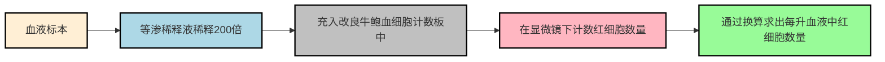
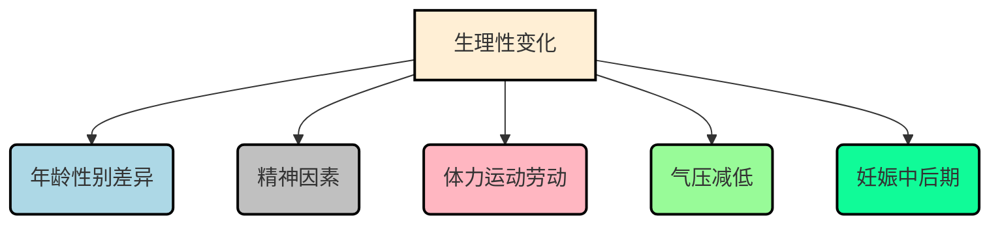
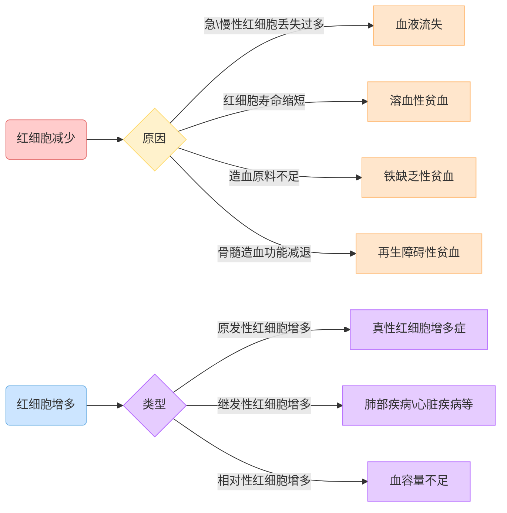
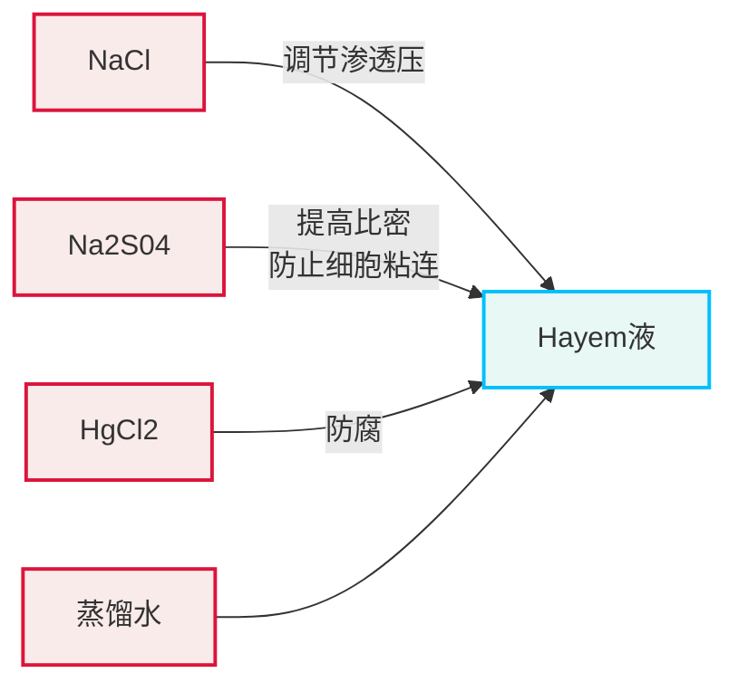
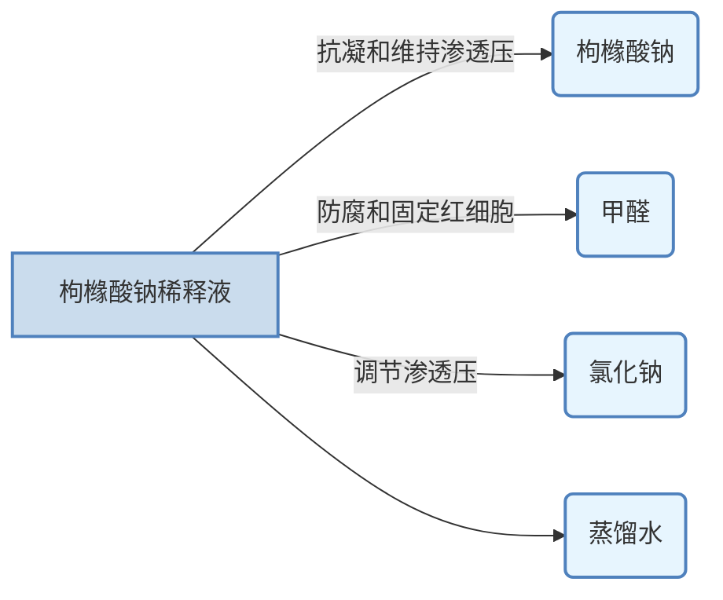

# 【2】红细胞计数

<kaodian :text="'临床检验基础记忆卡'" />

<!-- ###### 第二章 红细胞检查

> 临床检验基础 -->

<beitiL/>

---

## (1)检测原理(显微镜法)

<son :text="'临床检验基础检验记忆卡'" text1="(1)检测原理" :textOption="[['掌握','基础知识','相关专业知识'],['掌握','基础知识','专业知识'],['掌握','基础知识','专业知识']]" />
::::tip



```js
采用等渗稀释液将血液标本稀释一定倍数（200倍）后，充入`改良牛鲍(Neubauer）`血细胞计数板 (hemocytometer）中，在显微镜下计数一定区域(体积）内的红细胞数量，经换算求出每升血液中红细胞数量。
```

::::

---

## (2)方法学评价

<son :text="'临床检验基础检验记忆卡'" text1="(2)方法学评价" :textOption="[['了解','相关专业知识','专业实践能力'],['了解','专业知识','专业实践能力'],['掌握','专业知识','专业实践能力']]" />
::::tip

:::details 口诀记忆
白高红扰，数体误。

:::

```js
常用方法，比手工法精确（如电阻抗计数法的变异系数为`2%`，手工法则大于`11%`），且操作简便、快速。

当白细胞数量明显增高时，会`干扰红细胞计数和体积`测定而产生误差。
```

::::

## (3)质量控制

<son :text="'临床检验基础检验记忆卡'" text1="(3)质量控制" :textOption="[['了解','相关专业知识','专业实践能力'],['了解','专业知识','专业实践能力'],['熟练掌握','专业知识','专业实践能力']]" />
::::tip

:::details 口诀记忆
样本凝，操作差，器材不好，固有误差。

:::

```js
1. 样本:血液发生凝固。
2. 操作:稀释、充池、计数不规范。
3. 器材:微量吸管、计数板不标准。
4. 固有误差:计数域误差。
混淆选项：❌不同的操作者// [!code --]
```

::::

## (4)参考区间

<son :text="'临床检验基础检验记忆卡'" text1="(4)参考区间" :textOption="[['掌握','专业知识','专业实践能力'],['掌握','相关专业知识','专业实践能力'],['熟练掌握','相关专业知识','专业实践能力']]" />
::::tip

:::details 记忆技巧
实在想不出来
:::

```js
1. 成年女性`（3.5～5.0）`×10¹²／L；
2. 成年男性`（4.0～5.5）`×10¹²／L；
3. 新生儿`（6.0～7.0）`×10¹²／L。

```

::::

---

## (5)临床意义

<son :text="'临床检验基础检验记忆卡'" text1="(5)临床意义" :textOption="[['掌握','专业知识','专业实践能力'],['掌握','相关专业知识','专业实践能力'],['掌握','相关专业知识','专业实践能力']]" />
::::tip

:::details 图片记忆



:::

### 5.1 生理性变化

```js
1. 年龄与性别的差异:
`新生儿`，由于出生前处于生理性缺氧状态，故红细胞`明显增高`，较成人约增加35%，出生2周后逐渐下降，2个月婴儿约减少30%。男性在6～7岁时最低，随年龄增大而逐渐上升，25～30岁达到高峰，30岁后随年龄增大而逐渐下降，直到60岁尚未停止。女性也随年龄增大而逐渐上升，13～15岁达到高峰，随后受月经、内分泌等因素影响而逐渐下降，21～35岁维持最低水平，以后随年龄增大而逐渐上升，与男性水平相当。
2. 精神因素:
感情`冲动、兴奋、恐惧、冷水浴`等可使肾上腺素增多，导致红细胞`暂时增多`。
3. 剧烈体力运动和劳动:
由于需氧量增加，使红细胞生成素生成增加、骨髓加速释放红细胞，导致红细胞增多。
4. 气压减低:
高山地区居民和登山运动员因缺氧，红细胞代偿性增生，数量增高。
5. 妊娠中后期:
为适应胎盘循环需要，通过神经、体液调节，孕妇血浆容量明显增加使血液稀释，
导致`红细胞减少`。
```

::::

::::tip

:::details 图片记忆



:::

### 病理性变化

:::code-group

```js [红细胞减少]
1. 急、慢性红细胞丢失过多:
各种原因出血，如`消化性溃疡、痔疮、十二指肠钩虫病`等。
2. 红细胞寿命缩短:
各种原因`溶血`，如输血溶血反应、蚕豆病、遗传性球形细胞增多症等。
3. 造血原料不足:
如慢性失血者，因铁重新利用率减少、铁供应或吸收不足所致；
先天性或后天性`红细胞酶缺陷者`，因铁不能被利用、堆积在细胞内外所致如`铁粒幼
细胞`贫血；
某些药物，如异烟肼、硫唑嘌呤等；
继发于某些疾病，如类风湿关节炎、白血病、甲状腺功能亢进、慢性肾功能不全、
`铅中毒`等。
4. 骨髓造血功能减退:
某些药物，如抗肿瘤药物、磺胺类药物、保泰松、有机砷、马利兰等可抑制骨髓造血功能；
物理因素，如`X线、60钴、镭照射`等可抑制骨髓造血功能；
继发于其他疾病，如慢性肾功能衰竭；
原发性再生障碍性贫血。
```

```js [红细胞增多]
1. 原发性红细胞增多
   如`真性红细胞增多症`、良性家族性红细胞增多症等。
2. 继发性红细胞增多
   如房室间隔缺损、法洛四联症等各种先天性心血管疾病，肺气肿、肺源性心脏病、
   肺纤维化、矽肺和各种引起肺气体交换面积减少的疾病，异常血红蛋白病，肾上腺
   皮质功能亢进`（库欣病）`，某些药物如肾上腺素、糖皮质激素、雄激素等。
3. `相对`性红细胞增多
   如呕吐、严重腹泻、多汗、多尿、`大面积烧伤`、晚期消化道肿瘤而长期不能进食等
```

:::

::::

## (6)操作方法

<son :text="'临床检验基础检验记忆卡'" text1="(6)操作方法" :textOption="[['熟练掌握','相关专业知识','专业实践能力'],['掌握','专业知识','专业实践能力'],['了解','专业知识','专业实践能力']]" />
::::tip
:::details 图片记忆



:::
:::code-group

```js[改良牛鲍计数板]
6.1 改良牛鲍计数板:
计数池内划有长、宽各3.0mm的方格，分为`9个大格`，每个大格面积为10mm²，
容积为0.1mm³（μl）。其中，中央大方格用双线分成25个中方格，位于正中及四角
的5个中方格是红细胞和血小板计数区域，每个中方格用单线分为16个小方格。
四角的4个大方格是白细胞计数区域，用单线划分为`16个中方格`。

根据1941年国际标准局（NBS）规定，大方格每边长度允许误差为±1%，
即（1±0.01）mm，盖玻片与计数池间隙深度允许误差为±2%，即（0.1±0.002）mm。
```

```js[盖玻片]
6.2 盖玻片:
是专用的玻璃盖片，要求表面平整光滑，两面平整度在0.002mm以内，
盖玻片规格是24mm×20mm×0.6mm。

静置：室温下平放3～5min，待细胞下沉后于显微镜下计数。
```

```js[计数]
6.3 计数:
1. 先用低倍镜观察血细胞分布是否均匀，如严重分布不匀，应重新充池，
然后用高倍镜计数中央大方格内4角和正中5个中方格内的红细胞数。

1. 红细胞在计数池中若分布不均，每个中方格间相差超过20个应重新充池，
两次红细胞计数相差不得超过5%。

1. 计数时需遵循一定方向逐格进行，以免重复或遗漏，对压线细胞采用
`数左不数右、数上不数下`的原则。
```

```js[红细胞稀释液]
6.4 红细胞稀释液:
①Hayem液由`NaCl（调节渗透压）`、`Na2S04（提高比密防止细胞粘连）`、`HgCl2（防腐）`和蒸馏水组成，缺点是遇高球蛋白血症患者，由于蛋白质沉淀而使红细胞易凝集。

②枸橼酸钠稀释液由枸橼酸钠（抗凝和维持渗透压）、`甲醛（防腐和固定红细胞）`、氯化钠（调节渗透压）和蒸馏水组成。

③普通生理盐水或加1%甲醛生理盐水。
```

:::

::::
