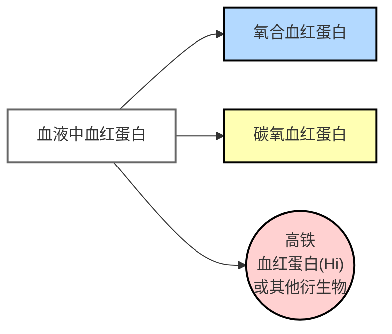
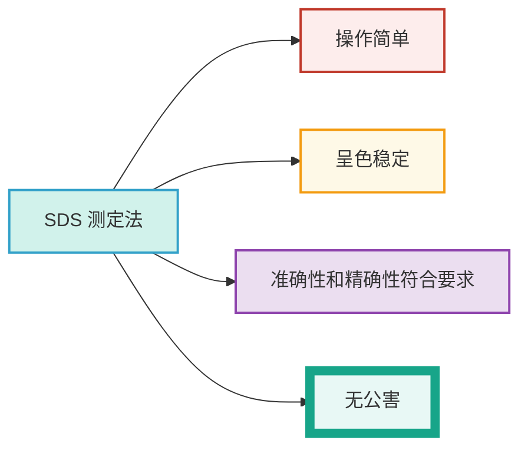
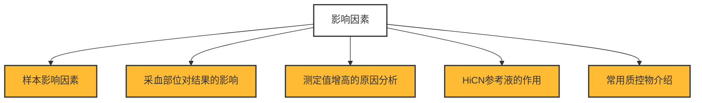
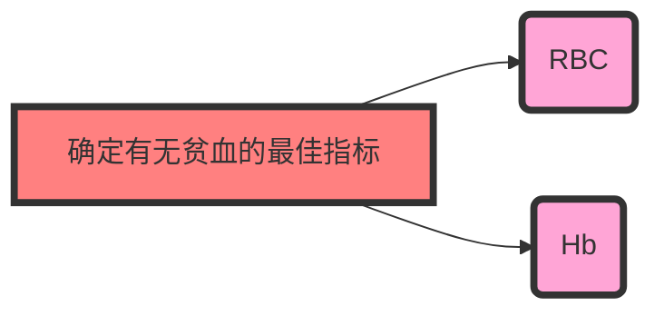

<!--startPrint-->

# 【3】血红蛋白测定

<kaodian :text="'临床检验基础记忆卡'" />

<!-- ###### 第二章 红细胞检查

> 临床检验基础 -->

<beitiL/>

---

## (1)检测原理

<son :text="'临床检验基础检验记忆卡'" text1="(1)检测原理" :textOption="[['掌握','基础知识','相关专业知识'],['掌握','基础知识','专业知识'],['掌握','基础知识','专业知识']]" />
::::tip

:::details 图片记忆



:::

血液中血红蛋白以各种形式存在，包括：`氧合`血红蛋白、`碳氧`血红蛋白、`高铁`血红蛋白（Hi）或其他衍生物。

```js
采用比色法测定
1. 氰化高铁血红蛋白（HiCN）测定法
2. 十二烷基硫酸钠血红蛋白（SDS）`【能破坏白细胞】`测定法// [!code focus]
3. 叠氮高铁血红蛋白（HiN3）法
4. 碱羟血红蛋白法
5. 溴代十六烷基三甲胺（CTAB）血红蛋白测定法
```

::::

---

## (2)方法学评价

<son :text="'临床检验基础检验记忆卡'" text1="(2)方法学评价" :textOption="[['了解','相关专业知识','专业实践能力'],['了解','专业知识','专业实践能力'],['掌握','专业知识','专业实践能力']]" />
::::tip

:::details 图片记忆



:::
:::code-group

```js [HiCN 法]
1966 年被`ICSH`推荐为`参考方法`。废液处理时常用`次氯酸钠`// [!code focus]
```

```js [SDS 测定法]
该法具有操作简单、呈色稳定、准确性和精确性符合要求、
`无公害`等优点。// [!code ++]
但由于摩尔消光系数尚未最后确认，
不能直接用吸光度计算 Hb 浓度，
而且 SDS 试剂`【能破坏白细胞】`的质量差异较大会影响检测结果。
```

```js [多参数血细胞分析仪]
优点是操作简单、快速，同时可获得多项红细胞参数，血红蛋白测定原理与手工法相似，仪器法测定精度（CV）约为 1%
```

:::

::::

---

## (3)质量控制

<son :text="'临床检验基础检验记忆卡'" text1="(3)质量控制" :textOption="[['了解','相关专业知识','专业实践能力'],['了解','专业知识','专业实践能力'],['熟练掌握','专业知识','专业实践能力']]" />
::::tip

:::details 图片记忆



:::

```js
1. 样本:
异常血浆蛋白质、高脂血症、白细胞数超过30×109/L、脂滴等可产生浊度， `干扰Hb`测定。// [!code focus]

1. 采血部位:
部位不同，结果不同，`静脉`血比毛细血管血`低` 10%～ 15%。// [!code focus]

1. 结果分析:
测定值假性增高的原因是稀释倍数不准、红细胞溶解不当、血浆中脂质或蛋白质量增加。

1. HiCN参考液:
是制备标准曲线、计算 K 值、校准仪器和其他测定方法的重要物质。

1. 质控物:
常用质控物有:ACD 抗凝全血、进口全血质控物、醛化半固定红细胞、溶血液和冻干全血等。
```

::::

::::info

:::details 补充：参考品质量标准

```js
1. 图形扫描波峰`（540±1）`nm，波谷 502 ～ 504nm。// [!code focus]
2. Aλ540nm／Aλ504nm ＝ 1.590 ～ 1.630。
3. Aλ750nm≤0.002。
4. 无菌试验：普通培养和厌氧培养阴性。
5. 精密度：随机抽样 10 支测定，CV≤0.5%。
6. 准确度：以 WH0 的 HiCN 参考品为标准进行测定，测定值与标示值之差 ≤±0.5%。
7. 稳定性：3 年内不变质，测定值不变。
8. 分装于`棕色安瓿瓶`内，每支不少于 10ml。// [!code focus]
9. 标签应写明产品名称、批号、含量、有效期、生产日期、贮存法等。
```

:::

::::

## (4)参考区间

<son :text="'临床检验基础检验记忆卡'" text1="(4)参考区间" :textOption="[['掌握','专业知识','专业实践能力'],['掌握','相关专业知识','专业实践能力'],['熟练掌握','相关专业知识','专业实践能力']]" />
::::tip

:::details 记忆技巧
男性的平均身高为170.
:::

```js
成年男性`120～170g／L`；
女性：`110～150g／L`；
新生儿：`170～200g／L`；

老年（70 岁以上）:
男性 94.2 ～ 122.2g／L；
女性 86.5 ～ 111.8g／L。
```

::::

## (5)临床意义

<son :text="'临床检验基础检验记忆卡'" text1="(5)临床意义" :textOption="[['掌握','专业知识','专业实践能力'],['掌握','相关专业知识','专业实践能力'],['掌握','相关专业知识','专业实践能力']]" />

::::tip

:::details 图片记忆



:::

:::code-group

```js [生理性变化]
1. 年龄:
随年龄增长，Hb 可增高或减低，和红细胞变化相似。

1. 时间:
红细胞和血红蛋白量有日内波动，上午 7 时达高峰，随后下降。
```

```js [病理性变化]
1. 某些疾病，血红蛋白和红细胞浓度不一定能正确反映全身红细胞的总容量。

如大量失血时，在补充液体前，虽循环血容量缩小，但血液浓度很少变化，从血红蛋白浓度来看，很难反映出存在贫血。

如水潴留时，血浆容量增大，即使红细胞容量正常，但血液浓度减低，从血红蛋白浓度来看，已存在贫血，反之，失水时，血浆容量缩小，即使血液浓度增高，但红细胞容量减少，从血红蛋白浓度来看，贫血不明显。

2. 发生大细胞性贫血或小细胞低色素性贫血时，红细胞计数与血红蛋白浓度不成比例。大细胞性贫血的血红蛋白浓度相对偏高，小细胞低色素贫血的血红蛋白低，但红细胞计数可正常。
```

:::
::::

## (6)氰化高铁血红蛋白测定法操作

<son :text="'临床检验基础检验记忆卡'" text1="(6)氰化高铁血红蛋白测定法操作" :textOption="[['熟练掌握','相关专业知识','专业实践能力'],['熟练掌握','专业知识','专业实践能力'],['了解','专业知识','专业实践能力']]" />
::::tip

```js
在 5ml HiCN 转化液中，加血 20ml，充分混合，静置 5min 后，倒入光径 1cm 比色皿，在波长 `540nm` 处，HiCN 转化液或蒸馏水调零，测定吸光度（A）。式中 A 为样本吸光度，44 为毫摩尔消光系数，64458/1000 为 1mol/LHb溶液中所含Hb克数，251 为稀释倍数。采用 HiCN参考液（50g/L、100g/L、150g/L、200g/L），在分光光度计上，波长 540nm处，测定各种参考液的吸光度，以参考液血红蛋白含量为横坐标，吸光度为纵坐标，绘制标准曲线，或求出换算常数（K）。然后，根据样本吸光度（A）在标准曲线查出血红蛋白浓度，或用 K值计算：Hb（g/L）＝ K×A。
```

::::

<!--endPrint-->
