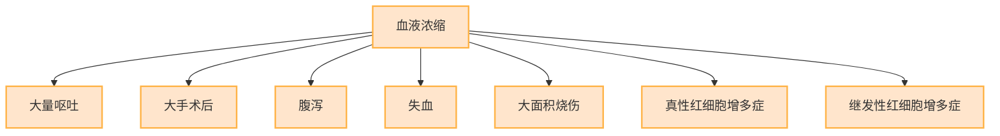
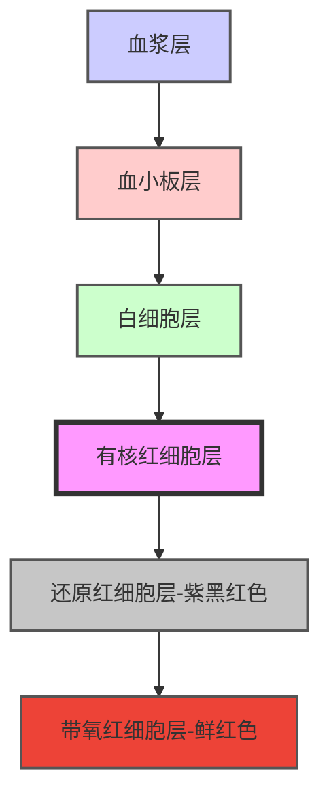

# 【5】血细胞比容测定

<kaodian :text="'临床检验基础记忆卡'" />

<beitiL/>

---

## (1)检测原理

<son :text="'临床检验基础记忆卡'" text1="(1)检测原理" :textOption="[['了解','基础知识','相关专业知识'],['了解','基础知识','专业知识'],['掌握','基础知识','专业知识']]" />

::::tip

```js
1. HCT 直接测定采用离心法

2. 间接测定采用血液分析仪法
```

::::

## （2 方法学评价

<son :text="'临床检验基础记忆卡'" text1="(2)方法学评价" :textOption="[['了解','相关专业知识','专业实践能力'],['了解','专业知识','专业实践能力'],['了解','专业知识','专业实践能力']]" />

::::tip

:::code-group

```js [温氏法(离心法)]
采用中速离心，不能完全排除红细胞间残留血浆，测定结果偏高。
```

```js [血液分析仪法]
仪器法 CV 为 1%，手工法 CV 为 2%，
仪器法应注意红细胞增多症或血浆渗透压常时会出现误差。
```

```js [🏆微量高速离心法]
被 WHO 推荐为 HCT 测定的`首选`常规方法。其相对离心力(RCF)`≥10000g`。优点`不`包括`红细胞间无残余血浆`。
```

:::
::::

## (3)质量控制

<son :text="'临床检验基础记忆卡'" text1="(3)质量控制" :textOption="[['了解','相关专业知识','专业实践能力'],['掌握','专业知识','专业实践能力'],['掌握','专业知识','专业实践能力']]" />

略

## (4)参考区间

<son :text="'临床检验基础记忆卡'" text1="(4)参考区间" :textOption="[['掌握','专业知识','专业实践能力'],['熟练掌握','相关专业知识','专业实践能力'],['熟练掌握','相关专业知识','专业实践能力']]" />

::::tip

```js
1. 成年：
男性 0.40~0.50；
女性 0.37~0.48。

2. 新生儿：0.47~0.67。

3. 儿童：0.33~0.42。
```

::::

## （5）临床意义

<son :text="'临床检验基础记忆卡'" text1="(5)临床意义" :textOption="[['了解','专业知识','专业实践能力'],['掌握','相关专业知识','专业实践能力'],['掌握','相关专业知识','专业实践能力']]" />

::::tip

:::details 图片记忆



:::
`临床输血、输液`疗效观察的指标。作为红细胞平均体积、红细胞平均血红蛋白浓度计算的基础数据。

:::code-group

```js[增高]
1. 增高
见于各种原因所致`血液浓缩`，如大量呕吐、大手术后、腹泻、失血、大面积烧伤、真性红细胞增多症、继发性红细胞增多症等。
```

```js[减低]
1. 减低
见于各种贫血。

```

:::

::::

## （6）操作方法（温氏法操作）

<son :text="'临床检验基础记忆卡'" text1="(6)操作方法" :textOption="[['熟练掌握','相关专业知识','专业实践能力'],['掌握','专业知识','专业实践能力'],['了解','专业知识','专业实践能力']]" />

::::tip

:::details 图片记忆



:::
:::code-group

```js[离心]

将离心管置于水平离心机以 2264g（即有效半径 22.5cm，`3000r／min`），离心 `30min`。
```

```js[观察结果]
离心后血液分为 5 层，自上而下分别为`血浆层`、`血小板层`、`白细胞层`和有`核红细胞层`、还原红细胞层（紫黑红色）、带氧红细胞层（鲜红色）。读取红细胞层柱高（以紫黑红色层为准）的毫米数，乘以 0.01，即为每升血液中红细胞体积的升数。
```

:::
::::
