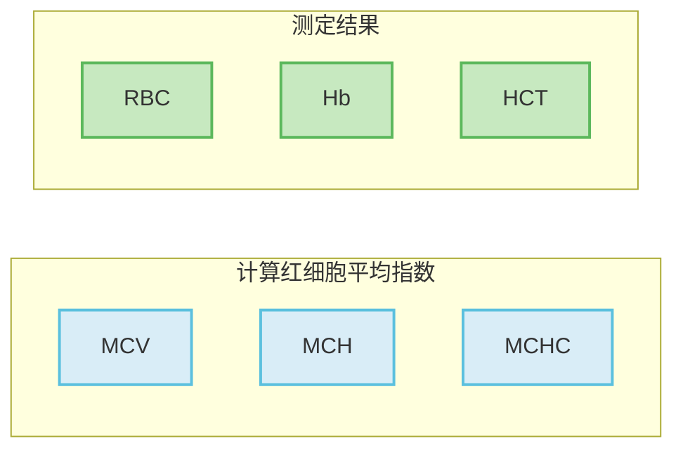

# 【1】红细胞平均指数

<kaodian :text="'临床检验基础记忆卡'" />

<!-- ###### 第二章 红细胞检查

> 临床检验基础 -->

<beitiL/>

---

## (1)检测原理

<son :text="'临床检验基础记忆卡'" text1="(1)检测原理" :textOption="[['掌握','基础知识','相关专业知识'],['掌握','基础知识','专业知识'],['掌握','基础知识','专业知识']]" />

::::tip

:::details 公式记忆



$$MCV=\frac{HCT }{RBC }$$

$$MCH=\frac{\text{Hb}}{\text{RBC}}$$

$$MCHC = \frac{Hb}{RBC \times MCV}$$

:::

:::code-group

```js[手工法]
1. 手工法:
根据 RBC、 Hb、HCT 测定结果计算红细胞平均指数。

平均红细胞容积MCV=每升血液中红细胞比积/每升血液中红细胞个数

平均红细胞血红蛋白含量MCH=每升血液中血红蛋白含量/每升血液中红细胞个数

平均红细胞血红蛋白浓度MCHC=每升血液中血红蛋白含量/每升血液中红细胞比积
```

```js[血液分析仪法]
2. 血液分析仪法:
 MCV 由血液分析仪`直接测定`导出。
```

:::
::::

## (2)方法学评价

<son :text="'临床检验基础记忆卡'" text1="(2)方法学评价" :textOption="[['了解','相关专业知识','专业实践能力'],['掌握','专业知识','专业实践能力'],['了解','专业知识','专业实践能力']]" />

::::tip

:::code-group

```js[MCV]
1. MCV`【每个 RBC 的平均体积】`:
红细胞凝集（如冷凝集综合征）、严重高血糖症（葡萄糖高于 6000mg／L）可使 MCV 假性增高。
```

```js[MCH]
2. MCH:
高脂血症、白细胞增多症可使 MCH 假性增高。
```

```js[MCHC]
3. MCHC:
受 Hct（血浆残留或出现异常红细胞）和Hb`（高脂血症、白细胞增多症）`的影响。
```

:::
::::

## (3)参考区间

<son :text="'临床检验基础记忆卡'" text1="(3)参考区间" :textOption="[['掌握','专业知识','专业实践能力'],['掌握','相关专业知识','专业实践能力'],['熟练掌握','相关专业知识','专业实践能力']]" />

<br/>

| 人群   | MCV(fl） | MCH(pg) | MCHC(g/L) |
| ------ | -------- | ------- | --------- |
| 成年人 | 80~100   | 26~34   | 320~360   |
| 1~3 岁 | 79~104   | 25~32   | 280~350   |
| 新生儿 | 86~120   | 27~36   | 250~370   |

## (4)临床意义

<son :text="'临床检验基础记忆卡'" text1="(4)临床意义" :textOption="[['了解','专业知识','专业实践能力'],['掌握','相关专业知识','专业实践能力'],['掌握','相关专业知识','专业实践能力']]" />

| 贫血分类         | MCV  | MCH  | MCHC | 贫血                                           |
| ---------------- | ---- | ---- | ---- | ---------------------------------------------- |
| 正细胞贫血       | 正常 | 正常 | 正常 | `再生障碍性贫血`、急性失血性贫血、某些溶血性贫血 |
| 大细胞贫血       | 增高 | 增高 | 正常 | 各种造血物质缺乏或利用不良的贫血               |
| 单纯小细胞贫血   | 减低 | 减低 | 正常 | 慢性感染、慢性肝肾疾病性贫血减低               |
| 小细胞低色素贫血 | 减低 | 减低 | 减低 | `缺铁性贫血`及铁利用不良贫血，慢性失血性贫血     |

<!--endPrint-->
