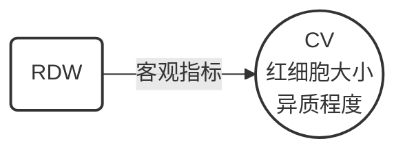
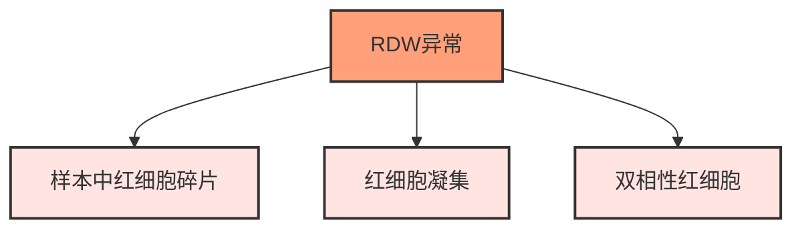

# 【1】红细胞体积分布宽度

<kaodian :text="'临床检验基础记忆卡'" />

<!-- ###### 第二章 红细胞检查

> 临床检验基础 -->

<beitiL/>

---

## (1)检测原理

<son :text="'临床检验基础记忆卡'" text1="(1)检测原理" :textOption="[['掌握','基础知识','相关专业知识'],['掌握','基础知识','专业知识'],['掌握','基础知识','专业知识']]" />

::::tip

:::details 重要

:::warning
【不是由血细胞分析仪直接测定而得】

:::

```js
红细胞体积分布宽度（RDW）反映样本中红细胞体积大小的`异质程度`，即反映`红细胞大小`的客观指标，常用变异系数（CV）表示，由血液分析仪的红细胞体积直方图导出。
```

::::

## (2)方法学评价

<son :text="'临床检验基础记忆卡'" text1="(2)方法学评价" :textOption="[['了解','相关专业知识','专业实践能力'],['了解','专业知识','专业实践能力'],['了解','专业知识','专业实践能力']]" />

::::tip

:::details 图片记忆



:::

```js
RDW 是对红细胞`体积大小`的评价，比血涂片红细胞形态大小的观察更为客观和准确。
```

::::

## (3)质量控制

<son :text="'临床检验基础记忆卡'" text1="(3)质量控制" :textOption="[['了解','相关专业知识','专业实践能力'],['了解','专业知识','专业实践能力'],['掌握','专业知识','专业实践能力']]" />

::::tip

:::details 图片记忆



:::

```js
`RDW` 异常受样本中`红细胞碎片`、`红细胞凝集`、`双相性红细胞`的影响。
```

::::

## (4)参考区间

<son :text="'临床检验基础记忆卡'" text1="(4)参考区间" :textOption="[['了解','专业知识','专业实践能力'],['掌握','相关专业知识','专业实践能力'],['熟练','相关专业知识','专业实践能力']]" />

::::tip

:::details 重点提示
:::warning

RDW 增大对`IDA` 的诊断灵敏度达 95%以上，特异性不强，可作为 IDA 的筛选诊断指标。当铁剂治疗有效时，RDW 开始增大，随后逐渐降至正常。

:::

```js
1. 成年人 ：80~100
2. 1~3 岁 ：79~104
3. 新生儿：86~120
```

::::

## (5)临床意义

<son :text="'临床检验基础记忆卡'" text1="(5)临床意义" :textOption="[['了解','专业知识','专业实践能力'],['掌握','相关专业知识','专业实践能力'],['掌握','相关专业知识','专业实践能力']]" />

| MCV  | RDW  | 贫血类型       | 常见病因和疾病                                                                                   |
| ---- | ---- | -------------- | ------------------------------------------------------------------------------------------------ |
| 减少 | 正常 | 小细胞均一性   | 单纯杂合子珠蛋白生成障碍性贫血`（轻型）`、某些继发性贫血                                         |
| 减少 | 增高 | 小细胞不均一性 | `缺铁性贫血`、β-珠蛋白生成障碍性贫血（非轻型）、HbH 病                                           |
| 正常 | 正常 | 正常体积均一性 | `再生障碍性贫血`、白血病、某些慢性肝病、肾性贫血，急性失血                                       |
| 正常 | 增高 | 正常体积不均一 | 混合型营养性缺乏性贫血，部分早期铁缺乏（尚无贫血）、血红蛋白病性贫血、骨髓纤维化、铁粒幼细胞贫血 |
| 增大 | 正常 | 大细胞均一性   | 骨髓增生异常综合征、部分再生障碍性贫血、部分肝病性贫血、某些肾病性贫血                           |
| 增高 | 增高 | 大细胞不均一性 | `巨幼细胞贫血`、某些肝病性贫血                                                                   |
