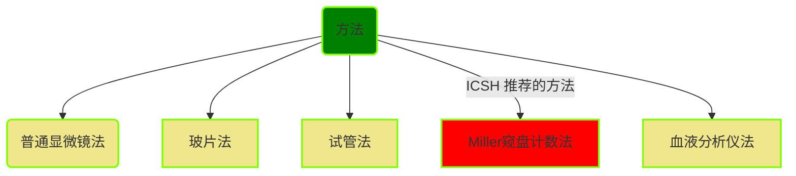

# 【1】网织红细胞计数

<kaodian :text="'临床检验基础记忆卡'" />

<!-- ###### 第二章 红细胞检查

> 临床检验基础 -->

<beitiL/>

---

## (1)检测原理

<son :text="'临床检验基础记忆卡'" text1="(1)检测原理" :textOption="[['熟练掌握','基础知识','相关专业知识'],['熟练掌握','基础知识','专业知识'],['掌握','基础知识','专业知识']]" />

::::tip

:::details 图片记忆


:::
:::code-group

```js [普通显微镜法]
活体染料`（新亚甲蓝或煌焦油蓝）`的碱性着色基团(带正电荷)可与网织红细胞RNA的磷酸基（带负电荷)结合，使RNA胶体间的负电荷减少而发生凝缩，形成蓝色的点状、线状或网状结构。
```

```js [血液分析仪法]
特殊染料与网织红细胞中`RNA`结合后进行 RNA 定量，可精确计数网织红细胞占红细胞的百分数（Ret%)，并可根据 RNA 含量将网织红细胞分类及计算网织红细胞其他参数。
```

:::

::::

## (2)方法学评价

<son :text="'临床检验基础记忆卡'" text1="(2)方法学评价" :textOption="[['了解','相关专业知识','专业实践能力'],['掌握','专业知识','专业实践能力'],['掌握','专业知识','专业实践能力']]" />

::::tip

:::details 图片记忆



:::

:::code-group

```js[普通显微镜法]
1. 普通显微镜法:
优点：简便、成本低，可直观细胞形态：
缺点：但影响因素多，重复性差
```

```js[玻片法]
2. 玻片法:
水分易蒸发，染色时间短，结果偏低

```

```js[试管法]
3. 试管法:
优点：易掌握，重复性较好，易复查
```

```js[Miller 窥盘计数法]
4. Miller 窥盘计数法:// [!code focus]
优点：规范计算区域，减少了实验误差，`ICSH 推荐的方法`// [!code focus]
```

```js[血液分析仪法]
5. 血液分析仪法:
优点：
检测细胞多，精密度高，与手工法相关性好，易标准化：
缺点：
仪器贵；
在出现豪焦小体、有核红细胞、巨大血小板时结果常出现假性增高。
```

:::

::::

## (3)质量控制

<son :text="'临床检验基础记忆卡'" text1="(3)质量控制" :textOption="[['了解','相关专业知识','专业实践能力'],['了解','专业知识','专业实践能力'],['了解','专业知识','专业实践能力']]" />

::::tip

:::details 表格记忆
:::warning
| 类型           | 内容物                                                 |
| -------------- | ------------------------------------------------------ |
| Ⅰ 型（丝球型） | 红细胞充满网状物，见于`骨髓`。                           |
| Ⅱ 型（网型）   | 红细胞网状物结构松散，见于骨髓。                       |
| Ⅲ 型（破网型） | 红细胞网状物结构稀少，呈不规则枝点状排列，见于外周血。 |
| Ⅳ 型（点粒型） | 红细胞内为分散的细颗粒、短丝状网状物，见于外周血。     |

:::
:::code-group

```js [显微镜法]
操作人员对网织红细胞识别不同、血涂片质量好坏、计数红细胞数量多少、计数方法等。
试管法染色时间为`15～20min`.
```

```js [仪器法]
出现 Howell-Jolly 小体、有核红细胞、巨大血小板会使结果假性增高。
```

:::

::::

## (4)参考区间

<son :text="'临床检验基础记忆卡'" text1="(4)参考区间" :textOption="[['掌握','专业知识','专业实践能力'],['掌握','相关专业知识','专业实践能力'],['掌握','相关专业知识','专业实践能力']]" />

::::tip

:::details 要点提示
:::warning
 网织红细胞计数
（尤其是网织红细胞绝对值）是反映`骨髓造血`功能的重要指标。
:::

:::code-group

```js[网织红细胞计数]

从网织红细胞成熟类型获得红细胞生成活性的其他信息，正常时，外周血网织红细胞中 Ⅲ 型约占 20%～ 30%，Ⅳ 型约占 70%～ 80%，若骨髓`增生明显`，可出现` Ⅰ 型和 Ⅱ 型`网织红细胞。
```

```js[参考区间]
① 成人、儿童：0.5%~1.5%。
② 新生儿：2.0%～ 6.0%。
③ 成人绝对值：(24 ～ 84）×10/L。
```

:::
::::

## （5） 临床意义

<son :text="'临床检验基础记忆卡'" text1="(5)临床意义" :textOption="[['掌握','专业知识','专业实践能力'],['掌握','相关专业知识','专业实践能力'],['熟练掌握','相关专业知识','专业实践能力']]" />

::::tip
:::details 要点提示
:::warning
当骨髓网织红细胞`增多`，外周血`减少`时，提示释放`障碍`；

骨髓和外周血网织红细胞`均增加`，提示为释放`增加`。
:::
:::code-group

```js[骨髓红细胞造血情况]
1. 判断骨髓红细胞造血情况:

（1）增多：见于`溶血性贫血`、放射治疗和化学治疗后。
（2）减少：见于再生障碍性贫血、溶血性贫血再障危象。
```

```js[贫血疗效]
2. 观察贫血疗效:

缺铁性贫血、巨幼细胞性贫血患者治疗前，Ret 仅轻度增高（也可正常或减少），
给予铁剂或`维生素B12、叶酸`治疗后，用药 3 ～ 5d 后，Ret 开始上升，7 ～ 10d 达高峰，2 周左右，
Ret 逐渐下降，`【先高后低】`表明治疗有效。

```

```js[骨髓移植后监测]
3. 骨髓移植后监测:

骨髓移植后第 21d，如 Ret 大于 15×109／L，表示无移植并发症；小于 15×109／L，
伴中性粒细胞和血小板增高，可能为骨髓移植失败。
```

:::
::::

## (6)操作方法(显微镜法注意事项)

<son :text="'临床检验基础记忆卡'" text1="(6)操作方法" :textOption="[['熟练掌握','相关专业知识','专业实践能力'],['掌握','专业知识','专业实践能力'],['掌握','专业知识','专业实践能力']]" />

::::tip

```js
（1）网织红细胞必须在活体染色时才能显示，WH0 推荐使用新亚甲蓝染液，其染色力强且稳定，煌焦油蓝染液操作简单、费用低廉，但易产生沉淀、工作效率不高、精度差（批内 CV 可达 20%以上）。染色时间不能过短。染色温度应控制在 37℃，因为室温（25℃）染色 Ret 检出率明显低于 37℃ 染色。
染液与血液比例以`1:1【各俩滴】`为宜，// [!code focus]
严重贫血时，可适量增加血量。

（2）血涂片要薄而均匀，红细胞无重叠。选择红细胞分布均匀、网织红细胞着色好的部位进行计数。

（3）为提高网织红细胞计数精度和速度，ICSH 推荐使用` Miller 窥盘`。// [!code focus]
其精度 CV 约为 10%。

（4）注意鉴别网织红细胞与 HbH 包涵体。Ret 为蓝绿色网状或点粒状物质，分布不均，HbH 包涵体为蓝绿色圆形小体，均匀散布于整个红细胞内。

（5）瑞氏染液复染可使网织红细胞值偏低。

```

::::
