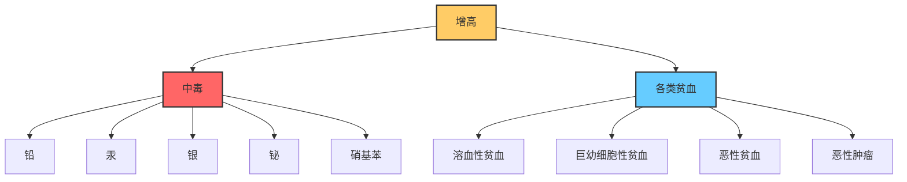
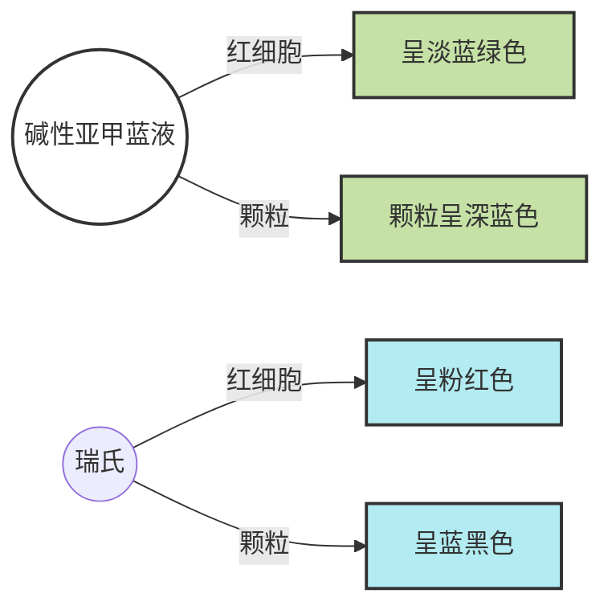

# 【9】点彩红细胞计数

<kaodian :text="'临床检验基础记忆卡'" />

<!-- ###### 第二章 红细胞检查

> 临床检验基础 -->

<beitiL/>

---

## (1)检测原理

<son :text="'临床检验基础检验记忆卡'" text1="(1)检测原理" :textOption="[['了解','基本知识','相关专业知识'],['了解','基本知识','专业知识'],['了解','基本知识','专业知识']]" />
::::tip

点彩红细胞是`尚未完全成熟`的红细胞在发育过程中受到损害，其胞质中残存变性的嗜碱性`RNA`，染色后呈现大小、形状不一的蓝色颗粒。

```js
制备血涂片，甲醇固定，亚甲蓝染色。
选择细胞分布均勾的区域，
油镜下计数 `1000 `个红细胞中嗜碱性点彩红细胞的数量，
或油镜下计数 50 个视野中的嗜碱性点彩红细胞，
同时计数 5 个视野中的正常红细胞数量，计算百分率。
```

::::

## (2)方法学评价

<son :text="'临床检验基础检验记忆卡'" text1="(2)方法学评价" :textOption="[['了解','相关专业知识','专业实践能力'],['了解','专业知识','专业实践能力'],['了解','专业知识','专业实践能力']]" />
略

## (3)质量控制

<son :text="'临床检验基础检验记忆卡'" text1="(3)质量控制" :textOption="[['了解','相关专业知识','专业实践能力'],['了解','专业知识','专业实践能力'],['了解','专业知识','专业实践能力']]" />
略

## (4)参考区间

<son :text="'临床检验基础检验记忆卡'" text1="(4)参考区间" :textOption="[['掌握','专业知识','专业实践能力'],['掌握','相关专业知识','专业实践能力'],['掌握','相关专业知识','专业实践能力']]" />
略

## (5)临床意义

<son :text="'临床检验基础检验记忆卡'" text1="(5)临床意义" :textOption="[['了解','专业知识','专业实践能力'],['了解','相关专业知识','专业实践能力'],['掌握','相关专业知识','专业实践能力']]" />
::::tip
:::details 图片记忆

:::
```js
增高见于中毒`如铅、汞、银、铋、硝基苯、苯胺等`、
或各类贫血如溶血性贫血、巨幼细胞性贫血、恶性贫血、恶性肿瘤等。
```

::::

## (6)操作方法

<son :text="'临床检验基础检验记忆卡'" text1="(6)操作方法" :textOption="[['熟练掌握','相关专业知识','专业实践能力'],['掌握','专业知识','专业实践能力'],['掌握','专业知识','专业实践能力']]" />

::::tip

:::details 图片记忆



:::

```js
点彩红细胞计数时，采用碱性亚甲蓝液染色后，红细胞呈淡蓝绿色，颗粒呈深蓝色；
采用瑞氏染色后，红细胞呈粉红色，颗粒呈蓝黑色。
通常油镜下计数`1000`个红细胞中点彩红细胞数，换算成百分率。
```

::::

<!--endPrint-->
